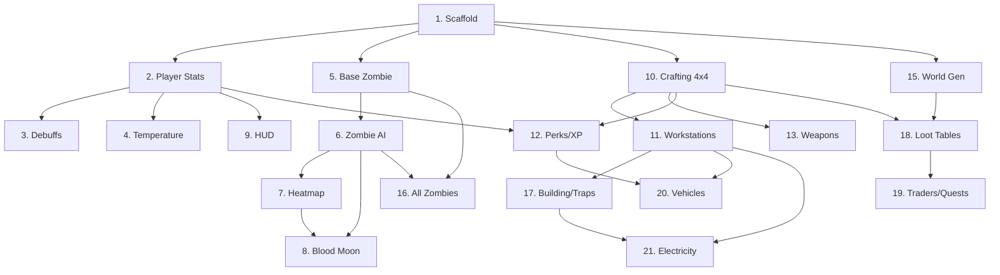

# Brutal Zombie Horde Survival — FINAL Production-Ready Specification

> **Disclaimer:** This mod is unofficial fan-made content inspired by 7 Days to Die and is not affiliated with, endorsed by, or connected to The Fun Pimps in any way.

### Aligned to the style of 7 Days to Die 2.6 Experimental (Feb 25, 2026)

> **Mod ID**: `sevendaystominecraft` | **Loader**: NeoForge 1.21+ | **Java**: 21 (required) | **Single JAR, zero dependencies**
> **Spec Version**: 1.0-FINAL | **Date**: March 2026

---

## Table of Contents

| # | Section | Description |
|---|---------|-------------|
| 1 | [Core Survival & Character Systems](#1-core-survival--character-systems) | HP, Stamina, Food, Water, Temperature, Debuffs, Heatmap, XP |
| 2 | [World Generation & Biomes](#2-world-generation--biomes) | Biomes, Cities, POIs, SI, Voxel Destruction |
| 3 | [Mobs, Zombies & AI](#3-mobs-zombies--ai) | All zombie variants (incl. Charged/Infernal), Animals, AI |
| 4 | [Horde Nights / Blood Moon](#4-horde-nights--blood-moon-events) | Scaling, waves, composition |
| 5 | [Skills, Perks & Progression](#5-skills-perks--progression) | Attributes, 100+ perks, Tier-10 Masteries, Magazines |
| 6 | [Crafting, Scrapping & Workstations](#6-crafting-scrapping--workstations) | 4×4 grid, Quality, Workstations, Jars (2.6), Scrapping |
| 7 | [Building, Traps & Base Defense](#7-building-traps--base-defense) | Upgrade paths, Traps, Land Claims |
| 8 | [Loot, Containers & Economy](#8-loot-containers--economy) | Loot Stage, Containers, Dukes |
| 9 | [Traders, NPCs & Quests](#9-traders-npcs--quests) | 5 Traders, Quest types, Economy |
| 10 | [Vehicles](#10-vehicles) | 5 vehicles, Physics, Fuel, Vehicle Mods (expanded) |
| 11 | [Electricity & Power Systems](#11-electricity--power-systems) | Generators, Solar, Wiring, Consumers |
| 12 | [Weapons, Armor & Combat](#12-weapons-armor--combat) | Melee, Ranged, Mods, Ammo, Armor, Combat |
| 13 | [Farming, Food & Cooking](#13-farming-food--cooking) | Crops, Cooking, Animal Husbandry |
| 14 | [UI, HUD & Visual/Audio Overhaul](#14-ui-hud--visualaudio-overhaul) | Custom HUD, Inventory, Map, VFX, Audio |
| 15 | [Additional Systems & Polish](#15-additional-systems--polish) | Temperature, Stealth, Forging, Commands, Multiplayer, Perf |
| 16 | [Mixin / ASM Override Targets](#16-mixin--asm-override-targets-neoforge-121) | All Mixin targets, NeoForge event hooks |
| 17 | [Balancing Formulas Reference](#17-balancing-formulas-reference) | All formulas in Java |
| 18 | [Code Snippet Placeholders](#18-code-snippet-placeholders-critical-subsystems) | City gen, Zombie AI, Electricity, Perks, Heatmap, Vehicles, Crafting |
| 19 | [Implementation Roadmap](#19-implementation-roadmap) | Phases, 32 milestones, dependency graph, risks |
| 20 | [Changelog & 2.6 Alignment](#20-changelog--26-alignment) | All 2.6 experimental changes integrated |
| 21 | [Next Steps for Developer](#21-next-steps-for-developer) | Git structure, Phase 1 commits, Testing checklist, Pitfalls |

---

## 20. Changelog & 2.6 Alignment

> All changes below reflect 7 Days to Die **Stable 1.0 + Experimental 2.6** (Feb 25, 2026).

| # | Area | Change | Spec Sections Affected |
|---|------|--------|----------------------|
| 1 | **Dew Collector / Jars** | Dew Collectors now require Glass Jars as "fuel" to produce water; jars crafted in Forge (sand + clay, no crucible); 60% jar refund chance on use | §1.1, §6.3, §6.5 |
| 2 | **Zombie XP Rebalance** | XP per kill rebalanced by type, HP, damage; player kill XP increased globally | §1.4, §17.1 |
| 3 | **Charged Zombie** | New variant — electric chain attacks (3-block chain, blue glow, stuns 1.5s) | §3.1, §3.2, §4.2 |
| 4 | **Infernal Zombie** | New variant — fire trail (1 fire/sec while walking, orange glow, fire DoT on hit) | §3.1, §3.2, §4.2 |
| 5 | **Tougher Biome Spawns** | Snow/Wasteland now spawn more Radiated, Charged, and Infernal Chuck zombies | §2.1, §3.1 |
| 6 | **Mutated Zombie Range** | Mutated zombies extended ranged attack distance to ~11 blocks | §3.1 |
| 7 | **Wasteland Weather** | New hot/cold dynamic weather events in Wasteland biome | §2.1, §15.1 |
| 8 | **Bear Pathing** | Bears can now fit through 1×2 (1 wide × 2 tall) spaces | §3.3 |
| 9 | **Animal Audio** | Snakes play footstep sounds; chickens have roaming cluck sounds | §3.3, §14.6 |
| 10 | **RWG Tweaks** | More trader/large-cap POI tiles in random world generation | §2.2 |
| 11 | **Perk Masteries** | Tier-10 capstone mastery abilities added to every attribute tree | §5.2 |
| 12 | **Smell System (3.0 Teaser)** | Zombies will track by player smell/heat signature (placeholder hooks) | §3.2 |
| 13 | **Radiation Storms** | Dynamic radiation storm weather in Wasteland | §2.1, §15.1 |
| 14 | **Datapack Support** | Full datapack extensibility for POIs, recipes, perks, magazines | §2.2, §5.3, §6, §18.4 |
| 15 | **Vehicle Mods (Expanded)** | Storage racks, armor plating, turret mounts, NOS, off-road tires | §10.4 (new) |

---

# PART 1 — CORE SYSTEMS (Sections 1–7)

---

## 1. Core Survival & Character Systems

**Goal**: Completely replace vanilla hunger, health, and saturation with a 7DTD-style multi-resource survival system.

### 1.1 Player Stats

| Stat | Default Max | Regen Rate | Drain Conditions | Mixin Target |
|------|------------|------------|------------------|--------------|
| **Health** | 100 (+ 10/level to 200 cap) | 0.5/sec when Food>50% & Water>50% | Combat damage, fall, fire, infection, radiation | `LivingEntity.hurt()`, `Player.getFoodData()` |
| **Stamina** | 100 (+ 5/perk) | 8/sec at rest; 4/sec while walking | Sprint (−10/s), melee swing (−8–25), mining (−5/swing), jump (−8) | New capability on `Player` |
| **Food (Fullness)** | 100 | — | Passive drain −0.2/min + activity multiplier | Override `FoodData` entirely |
| **Water (Hydration)** | 100 | — | Passive drain −0.3/min + heat biome multiplier (×1.5 desert) | New stat in custom `FoodData` |
| **Core Temperature** | 70°F baseline | Adjusts ±2°F/sec toward ambient | Biome, altitude, time of day, clothing, fires, wetness | New system; no vanilla equivalent |

**Starvation/Dehydration cascade:**
- Food < 30 → stamina regen halved.
- Food < 10 → health drains −0.5/sec.
- Food = 0 → health drains −2/sec, movement −40%.
- Water follows identical thresholds with separate tracking.

**Water Collection — Dew Collector (2.6 Update):**
- **Dew Collector Block**: Craftable (Scrap Iron ×8, Duct Tape ×2, Plant Fiber ×4). Placed outdoors.
- **Requires Glass Jars as fuel**: Insert empty Glass Jars into the collector. Each jar fills over 60 min (real time) → produces 1 Jar of Murky Water.
- **Jar refund chance**: 60% chance the Glass Jar is returned after water extraction (config `dewCollector.jarRefundChance`, float 0.0–1.0, default 0.6).
- **Glass Jar crafting**: Forge recipe — Sand (×2) + Clay (×1) → Glass Jar (×3). **No crucible required** (2.6 change).
- **Config**: `dewCollector.fillTimeSec` (int, default 3600), `dewCollector.enabled` (bool, default true).

### 1.2 Health Conditions & Debuffs

| Condition | Trigger | Effect | Cure | Duration |
|-----------|---------|--------|------|----------|
| **Bleeding** | Melee hit (30% chance per zombie hit) | −1 HP/3sec | Bandage, First Aid Bandage | Until cured or death |
| **Infection (Stage 1)** | Zombie hit (10% base, +5%/feral) | Stamina regen −25% | Honey, Herbal Antibiotics | 24h → Stage 2 |
| **Infection (Stage 2)** | Untreated Stage 1 | −0.5 HP/sec, vision blur | Antibiotics only | 24h → death |
| **Dysentery** | Drinking murky water (100%), raw meat (40%) | Water drains ×3, food drains ×2 | Goldenrod Tea + rest | 60 min |
| **Sprain** | Fall 4–7 blocks | Movement −30% | Splint | 30 min after splint |
| **Fracture** | Fall 8+ blocks | Movement −60%, no sprint | Plaster Cast (Splint + Duct Tape) | 60 min after cast |
| **Concussion** | Explosion within 3 blocks | Screen shake, aim sway +50% | Time only | 45 sec |
| **Burn** | Fire/lava contact, Molotov, Infernal zombie hit | −2 HP/sec while active, then −0.5/sec lingering | Aloe Cream | 10 sec active + 20 sec linger |
| **Hypothermia** | Core Temp < 32°F for 120sec (90sec in 2.6 wasteland cold event) | Stamina drain ×2, movement −20% | Warm clothing, campfire proximity | Until temp > 50°F |
| **Hyperthermia** | Core Temp > 110°F for 120sec (90sec in 2.6 wasteland hot event) | Water drain ×3, stamina drain ×1.5 | Shade, cold drinks, remove clothing layers | Until temp < 100°F |
| **Radiation Sickness** | Wasteland biome exposure / Radiation Storm | −1 HP/5sec, max health reduces by 1/30sec | Rad-Away pills + leave zone | Until cured |
| **Electrocuted** | Charged zombie chain attack | No movement 1.5sec, −5 HP burst | None | 1.5 sec |
| **Stunned** | Cop zombie bile, Demolisher blast | No movement 2sec | None | 2 sec |

**Debuff stacking rules:**
- Multiple bleeds: Damage stacks (max 3 stacks = −1 HP/sec).
- Infection + Dysentery: Both apply independently.
- Fracture overrides Sprain (worse replaces lesser on same limb).
- Electrocuted and Stunned do not stack (longest remaining wins).
- All debuffs render as HUD icons with countdown timers.
- Visual effects: Bleeding = red vignette pulse; Infection = green tint + cough particles; Dysentery = stomach gurgle audio; Fracture = limping animation override; Electrocuted = blue screen flash + spark particles.

### 1.3 Heatmap System

The Heatmap is an invisible per-chunk value (0–100) that drives enemy spawns.

**Heat sources:**

| Activity | Heat/Event | Radius (chunks) | Decay Rate |
|----------|-----------|-----------------|------------|
| Gunshot | +15 | 6 | −2/min |
| Forge running | +3/min (capped +30) | 4 | −1/min |
| Campfire | +1/min (capped +10) | 2 | −1/min |
| Mining (per block) | +0.5 | 3 | −2/min |
| Sprinting | +0.2/sec | 2 | −3/min |
| Torch placement | +2 (one-time) | 1 | −1/min |
| Vehicle engine | +5/sec | 5 | −2/min |
| Screamer scream | +40 (instant) | 8 | −1/min |
| Explosion | +25 | 6 | −2/min |

**Spawn thresholds:**
- Heat 25+: Scout zombies begin investigating (1–2 wanderers).
- Heat 50+: Screamer spawns guaranteed within 60 sec.
- Heat 75+: Mini-horde (8–12 zombies) spawns from nearest dark area.
- Heat 100: Continuous wave spawns every 90 sec until heat decays below 75.

**Config**: `heatmap.enabled` (bool, default true), `heatmap.decayMultiplier` (float, 0.1–5.0, default 1.0), `heatmap.spawnThresholdMultiplier` (float, 0.5–3.0, default 1.0).

### 1.4 Character Level & XP

**XP Sources (2.6 Rebalanced):**

| Activity | Base XP | Multiplier | 2.6 Notes |
|----------|---------|------------|-----------|
| Zombie kill (Walker) | 200 | ×1.0 | ↑ from 150 |
| Zombie kill (Feral) | 350 | ×1.0 | New tier |
| Zombie kill (Radiated) | 500 | ×1.0 | ↑ from 225 |
| Zombie kill (Charged) | 550 | ×1.0 | **NEW 2.6** |
| Zombie kill (Infernal) | 550 | ×1.0 | **NEW 2.6** |
| Zombie kill (Demolisher) | 800 | ×1.0 | ↑ from 450 |
| Zombie kill (Behemoth) | 2000 | ×1.0 | Boss XP |
| Player kill (PvP) | 500 | ×1.0 | ↑ from 0 (2.6) |
| Animal kill | 50–200 (by type) | — | — |
| Block mined | 1–5 (by hardness) | — | — |
| Item crafted | 5–50 (by complexity) | ×1.5 if first time | — |
| Quest completed | 200–2000 | Tier multiplier | — |
| Loot container opened (first time) | 10–30 | — | — |
| POI cleared | 500–3000 | By tier | — |

**Leveling formula:** `XP_to_next = floor(1000 × level ^ 1.05)` — Level 1→2 = 1000 XP, Level 50→51 = ~72,400 XP, soft cap at level 300.

Each level-up grants **1 perk point**. Every 10 levels grants **1 bonus attribute point**.

---

## 2. World Generation & Biomes

**Goal**: Replace the entire Overworld with a post-apocalyptic 7DTD landscape. Disable Nether/End portals (config option to re-enable).

### 2.1 Biome Definitions (2.6 Updated Spawns & Weather)

| Biome | Temperature | Zombie Density | Loot Tier | Special Features | 2.6 Updates |
|-------|------------|---------------|-----------|------------------|-------------|
| **Pine Forest** | 50–70°F | Low (×0.6) | 1–3 | Starter-friendly, deer/rabbits, log cabins | — |
| **Forest** | 55–75°F | Medium (×1.0) | 2–4 | Mixed POIs, small towns, varied wildlife | — |
| **Plains** | 60–85°F | Medium (×1.0) | 2–4 | Wide open, farms, wind exposure | — |
| **Desert** | 85–130°F | Medium (×1.2) | 3–5 | Water scarcity, oil shale, rattlesnakes | — |
| **Snowy (Tundra)** | −10–32°F | Low-Med (×0.8) | 3–5 | Hypothermia risk, wolves, igloos/bunkers | **2.6**: +Radiated/Charged/Infernal Chuck spawns; cold snap events (−30°F, 10 min) |
| **Burned Forest** | 70–90°F | High (×1.5) | 3–5 | Ash particles, dead trees, charred buildings | — |
| **Wasteland** | 80–110°F + radiation | Extreme (×2.5) | 5–6 | Radiation zones, feral-only, military POIs | **2.6**: +Radiated/Charged/Infernal Chuck spawns; hot events (140°F, hyperthermia ×1.5 onset); cold events (10°F, hypothermia ×1.5 onset); **Radiation Storms** (§15.1) |

**Wasteland Dynamic Weather (2.6 NEW):**
- **Heat Wave**: 15% chance per in-game day. Ambient temp spikes to 140°F for 10 min. Hyperthermia onset timer reduced to 90sec.
- **Cold Snap**: 10% chance per in-game day (night only). Ambient temp drops to 10°F for 10 min. Hypothermia onset timer reduced to 90sec.
- **Radiation Storm**: 8% chance per in-game day. Green fog + particle effects. Radiation damage ticks even in shelter (reduced by 50% indoors). Duration 5 min. See §15.1.
- **Config**: `wasteland.heatWaveChance` (float), `wasteland.coldSnapChance` (float), `wasteland.radStormChance` (float).

### 2.2 City & POI Generation

**City generation pipeline:**
1. Voronoi partition world into "regions" (2048×2048 blocks).
2. Each region rolls city density: 0 (wilderness), 1 (hamlet, 5–10 POIs), 2 (town, 20–50 POIs), 3 (city, 100–300 POIs).
3. Generate road grid (main roads 5-wide asphalt, side streets 3-wide).
4. Place POIs from template pool along roads with setback rules.
5. Fill remaining lots with parking lots, parks, rubble.

**2.6 RWG Tweaks**: Increased weight for Trader compound tiles and large-cap (Tier 4–5) POI tiles in the random generation pool, ensuring traders appear more frequently and large dungeon-style POIs are less rare.

**POI template system:**
- Templates stored as `.nbt` structure files in `/data/sevendaystominecraft/structures/pois/`.
- Each template has metadata JSON: `tier` (1–5), `biomes` (allowed), `size` (footprint), `lootContainers` (list of positions + loot table IDs), `zombieSpawnPoints` (positions + variant weights), `questTarget` (bool).
- Templates are rotatable (0/90/180/270) and mirror-able.
- ~300 templates at launch; framework supports **data packs** for community templates.
- **Datapack extensibility**: Third-party datapacks can add POIs by placing `.nbt` files and corresponding metadata JSON in `data/<namespace>/structures/pois/`. The mod scans all loaded datapacks at world load.

**POI categories (minimum set):**

| Category | Count | Examples |
|----------|-------|---------|
| Residential | 60+ | Suburban houses (10 variants), apartments, trailer parks, cabins |
| Commercial | 50+ | Gas stations, grocery stores, pharmacies, bars, gun shops, hardware stores |
| Industrial | 30+ | Factories, warehouses, water treatment, power plants |
| Civic | 20+ | Police stations, fire departments, hospitals, schools, churches |
| Military | 15+ | Army bases, bunkers, checkpoints, crashed helicopters |
| Wilderness | 25+ | Caves, mineshafts, campgrounds, ranger stations, hunting blinds |
| Special | 10+ | Trader compounds, quest-only POIs, boss lairs |

### 2.3 Terrain & Block Palette

- **Surface blocks**: Asphalt, concrete sidewalks, dirt road, gravel, sand, snow layer, ash.
- **Building blocks**: Drywall, brick, commercial metal, corrugated iron, rebar concrete, bulletproof glass, steel plates.
- **Decorative/loot**: Filing cabinets, desks, refrigerators, couches, beds, bookshelves, medicine cabinets, gun safes, car wrecks (all function as containers).
- **Natural**: Ore nodes (iron, lead, nitrate, coal, oil shale, diamond/tungsten) replace vanilla ores with 7DTD equivalents.

### 2.4 Structural Integrity (SI)

| Material | SI (Max Support) | Weight | Horizontal Span |
|----------|-----------------|--------|-----------------|
| Wood Frame | 10 | 1 | 3 blocks |
| Cobblestone | 30 | 3 | 5 blocks |
| Concrete | 60 | 5 | 8 blocks |
| Reinforced Concrete | 80 | 6 | 10 blocks |
| Steel | 100 | 8 | 15 blocks |

- Blocks not supported collapse after 0.5 sec delay (cascade possible).
- SI checked on block break/place using BFS from ground-connected pillars.
- **Config**: `structuralIntegrity.enabled` (bool, default true), `structuralIntegrity.collapseDelay` (ticks, default 10).

### 2.5 Voxel Destruction

- Every block is destructible (no bedrock except at y=−64).
- Block HP by material tier: Wood 100 → Cobble 500 → Concrete 1500 → Reinforced 3000 → Steel 5000.
- Explosions use spherical damage falloff: `damage = baseDamage × (1 − distance/radius)^2`.
- Damage persists across sessions (no vanilla block regeneration).
- **Mixin target**: `ServerLevel.destroyBlock()`, `Block.getDestroyProgress()`.

---

## 3. Mobs, Zombies & AI

**Goal**: Replace ALL vanilla hostile mobs with 7DTD zombie variants. Vanilla animals partially replaced.

### 3.1 Zombie Variants (2.6 Updated — Including Charged & Infernal)

| Variant | HP | Damage | Speed (b/s) | Special | Spawn Day | XP (2.6) | Loot |
|---------|-----|--------|-------------|---------|-----------|----------|------|
| **Walker** | 100 | 8 | 1.0 | Basic, slow | 1+ | 200 | Rotten flesh, cloth |
| **Crawler** | 60 | 10 | 0.8 | Low profile, hard to hit | 1+ | 150 | Cloth, bones |
| **Frozen Lumberjack** | 150 | 12 | 0.9 | Snow biome exclusive | 1+ | 250 | Wood, nails |
| **Bloated Walker** | 200 | 10 | 0.7 | Explodes on death (2-block radius) | 3+ | 300 | Rotten flesh, fat |
| **Spider Zombie** | 120 | 14 | 1.8 | Climbs walls, jumps 3 blocks | 5+ | 300 | Acid, spider gland |
| **Feral Wight** | 300 | 20 | 2.5 | Always sprints, glowing eyes | 7+ | 350 | Iron, mechanical parts |
| **Cop** | 350 | 15 melee / 25 bile | 1.2 | Acid spit (8-block range, 3sec CD), explodes at 20% HP | 14+ | 400 | Acid, pistol parts |
| **Screamer** | 80 | 5 | 1.5 | Screams → spawns 4–8 zombies, flees | 7+ | 250 | Cloth, antibiotics |
| **Zombie Dog** | 80 | 18 | 3.5 | Pack spawns (3–5), fast, no climb | 3+ | 200 | Bones, animal fat |
| **Vulture** | 60 | 12 | 4.0 (flying) | Dive attacks, hard to hit | 7+ | 200 | Feathers, rotten flesh |
| **Demolisher** | 800 | 30 | 1.0 | C4 vest: chest-hit → 8-block explosion; must headshot | 21+ | 800 | Mechanical parts, explosives |
| **Radiated (any base)** | ×2 HP | ×1.5 dmg | ×1.3 speed | Green glow, regen 2 HP/sec | 28+ | 500 | Rare schematics, advanced parts |
| **Charged (2.6 NEW)** | ×1.8 HP | ×1.3 dmg | ×1.2 speed | **Blue glow**; chain lightning on hit (arcs to entities within 3 blocks, stuns 1.5sec, −5 HP per arc, max 3 chain targets) | 21+ | 550 | Electrical parts, rare components |
| **Infernal (2.6 NEW)** | ×1.8 HP | ×1.4 dmg | ×1.1 speed | **Orange glow**; leaves fire trail (1 fire block/sec while moving); melee hit applies Burn debuff (5 sec) | 21+ | 550 | Oil shale, rare components |
| **Mutated Chuck** | 250 | 18 | 1.3 | Ranged vomit attack (2.6: **~11 block range**, up from 8) | 14+ | 350 | Rotten flesh, acid |
| **Zombie Bear** | 600 | 35 | 2.0 | Charges, AoE swipe | 14+ | 500 | Animal fat, bones, meat |
| **Nurse** | 120 | 10 | 1.0 | Heals nearby zombies 5 HP/sec in 5-block radius | 7+ | 250 | First aid, painkillers |
| **Soldier** | 400 | 25 | 1.5 | Military loot, higher block damage | 14+ | 400 | Ammo, weapon parts |
| **Behemoth** (Boss) | 2000 | 50 | 0.8 | Immune to knockback, AoE ground pound (6-block radius) | 35+ (rare) | 2000 | Unique schematics, tier 6 items |

**2.6 Biome Spawn Adjustments (Snow & Wasteland):**
- Snow/Tundra: Radiated, Charged, and Infernal Chuck zombies now appear at day 21+ (previously only Walkers/Lumberjacks). Spawn weight: 15% Charged, 10% Infernal, 15% Radiated in day 28+ pools.
- Wasteland: Charged and Infernal variants start from day 14+. Feral variants remain dominant. All mutated variants have extended 11-block ranged attack.

### 3.2 Zombie AI System

**Priority-based behavior tree:**
```
Root (Selector)
├── [1] Flee → only Screamer when player within 5 blocks after screaming
├── [2] Attack Target → if player/block in range
│   ├── Melee attack (within 2 blocks)
│   ├── Ranged attack (Cop bile / Mutated vomit, if >4 blocks; Charged chain, if >2 blocks)
│   └── Block destruction (pathfind to player, destroy blocks in path)
├── [3] Investigate → move toward heat source / last known player pos
├── [3.5] Smell Track (3.0 Teaser) → move toward player smell trail (see below)
├── [4] Horde Path → during Blood Moon, path to player using A* with block-break cost
└── [5] Wander → random movement within spawn chunk
```

**Charged Zombie AI additions:**
- On melee hit, triggers `ChainLightningEvent`: scans 3-block radius for additional `LivingEntity` targets (max 3 chains). Each chain deals 5 HP + applies `Electrocuted` debuff (1.5s stun). Visual: blue arc particle between entities.
- Chain does NOT arc through blocks (line-of-sight check per target).

**Infernal Zombie AI additions:**
- Every 20 ticks while moving, places a `FIRE_TRAIL` block at current position (burns for 5 sec, deals 2 HP/sec to entities). Fire trails do not spread to adjacent blocks.
- Melee hit applies `Burn` debuff (5s active burn).
- Immune to fire damage itself.

**Smell System (3.0 Preview — Placeholder Hooks):**
- Players emit a "smell value" based on: raw meat in inventory (+20), blood (+15 if bleeding), recent cooking (+10 for 5 min), no shower/water contact for 60+ min (+5).
- Zombies within 20 blocks can detect smell > 15 and path toward the smell source.
- **Implementation**: Hooks and capability registered but gated behind config `smell.enabled` (bool, default false). Full implementation deferred to future 3.0 alignment update.
- Data stored as `SmellCapability` on Player entity.

**Pathfinding details:**
- Custom A* implementation with block-break cost function: `cost = baseCost + (blockHP / zombieDamage) × timeMultiplier`.
- Zombies prefer paths through weakest blocks (wood doors > windows > drywall > concrete).
- During Blood Moon, zombies receive global pathing toward nearest player with 64-block scan radius, expanded to 128 on day 21+.
- Spider Zombies add vertical edges (wall climb) to pathfinding graph.
- Group coordination: When 3+ zombies target same block, damage stacks (simulating coordinated bashing).

**Spawning rules:**
- Day: Zombies spawn in dark areas, indoors POIs, underground. Outdoor spawns only biome wanderers (low density).
- Night (18:00–06:00): Spawn rate ×3, all zombies sprint-capable gain +50% speed.
- Blood Moon: Override all spawn rules. Dedicated horde spawner activates.
- Spawn cap: `maxZombies = baseMax + (dayNumber × 2)` capped at config max (default 64 per player, configurable 16–256).

### 3.3 Animals (2.6 Updated)

| Animal | HP | Behavior | Drops | 2.6 Notes |
|--------|-----|----------|-------|-----------|
| **Deer** | 80 | Flees on sight (24-block range) | Raw Venison (×3), Bone (×2), Animal Hide (×2) | — |
| **Rabbit** | 15 | Flees on sound | Raw Rabbit (×1), Bone (×1) | — |
| **Chicken** | 10 | Wanders, farmable | Raw Chicken, Feather, Egg (1/day if alive) | **2.6**: Roaming cluck ambient sounds every 15–30 sec |
| **Boar** | 150 | Neutral → hostile if hit | Raw Pork (×4), Animal Fat (×2), Bone (×3) | — |
| **Wolf** | 120 | Hostile at night, neutral day | Raw Meat (×2), Animal Hide (×3), Bone (×2) | — |
| **Bear** | 400 | Hostile at 12-block range | Raw Meat (×6), Animal Fat (×4), Bone (×5), Bear Hide | **2.6**: Can fit through 1×2 spaces (1 wide × 2 tall); collision box adjusted |
| **Snake** | 30 | Desert, attacks if stepped on | Venom Sac, Raw Meat (×1) | **2.6**: Plays footstep/slither sounds when moving (audible within 8 blocks) |

**Bear pathing (2.6):** Bear entity's bounding box reduced from 1.4×1.4 to 0.95×1.8 when in "squeeze" mode (navigating through 1-wide gaps). Triggers `BearSqueezeEvent` for AI path recalculation. Bears can now breach 1-wide doorways.

---

## 4. Horde Nights / Blood Moon Events

### 4.1 Blood Moon Mechanics

**Trigger**: Every N days (config `hordeCycleLength`, default 7, range 1–30).

**Timeline for a blood moon night:**

| Time | Event |
|------|-------|
| 20:00 (day before) | "Horde Night Tomorrow" warning in chat + HUD icon |
| 18:00 (horde day) | Sky turns red, fog thickens, ambient music shifts |
| 18:30 | Warning siren sound effect |
| 22:00 | **Horde spawning begins** — Wave 1 |
| 22:00–04:00 | Waves every `waveInterval` minutes (default 10) |
| 04:00 | Final wave (heaviest), spawning ends |
| 06:00 | Dawn — sky clears, surviving zombies burn (configurable) or flee |

### 4.2 Horde Scaling Formula

```
hordeSize = floor(baseCount × (1 + (dayNumber / hordeCycleLength) × difficultyMult) ^ 1.2)
```

| Config Key | Default | Range | Description |
|------------|---------|-------|-------------|
| `horde.baseCount` | 8 | 4–64 | Zombies in wave 1 on day 7 |
| `horde.difficultyMultiplier` | 1.0 | 0.1–5.0 | Scales growth curve |
| `horde.maxPerWave` | 64 | 16–256 | Hard cap per wave |
| `horde.waveCount` | 4 | 1–12 | Number of waves per blood moon |
| `horde.waveIntervalSec` | 600 | 120–1800 | Seconds between waves |
| `horde.burnAtDawn` | true | bool | Surviving zombies burn at sunrise |
| `horde.demolisherDay` | 21 | 7–100 | First day Demolishers appear in hordes |
| `horde.feralDay` | 14 | 1–100 | First day Ferals appear in hordes |
| `horde.chargedDay` | 21 | 7–100 | First day Charged appear in hordes **(2.6 NEW)** |
| `horde.infernalDay` | 21 | 7–100 | First day Infernals appear in hordes **(2.6 NEW)** |

**Wave composition by day (2.6 Updated):**

| Day | Walkers % | Crawlers % | Ferals % | Cops % | Demolishers % | Radiated % | Charged % | Infernal % |
|-----|-----------|------------|----------|--------|---------------|------------|-----------|------------|
| 7 | 70 | 20 | 10 | 0 | 0 | 0 | 0 | 0 |
| 14 | 40 | 15 | 30 | 15 | 0 | 0 | 0 | 0 |
| 21 | 15 | 8 | 25 | 18 | 12 | 5 | 10 | 7 |
| 28+ | 8 | 4 | 20 | 16 | 12 | 18 | 12 | 10 |
| 49+ | 3 | 3 | 15 | 12 | 17 | 22 | 15 | 13 |

---

## 5. Skills, Perks & Progression

### 5.1 Attribute System

5 attributes, each level 1–10. Cost: 1 attribute point per level. Points earned every 10 character levels + quest rewards.

| Attribute | Governs | Key Unlocks | **Tier 10 Mastery (2.6 NEW)** |
|-----------|---------|-------------|-------------------------------|
| **Strength** | Melee damage, carry weight, club/sledge | T3: Steel tools, T7: Machete master | **Titan**: All melee attacks have 15% chance to stagger any zombie (including Demolishers/Behemoths) |
| **Perception** | Ranged damage, awareness, rifles/explosives | T3: Scoped weapons, T7: Sniper headshot bonus | **Eagle Eye**: Headshots deal ×4.0 damage (up from ×2.5); critical hit particles visible |
| **Fortitude** | Health, disease resist, healing, brawling | T3: Iron Gut, T7: Living Off the Land 3 | **Unkillable**: Upon fatal damage, survive with 1 HP + 10 sec invulnerability (60 min cooldown) |
| **Agility** | Stamina, stealth, speed, knives/bows | T3: Parkour, T7: Silent kill bonus | **Ghost**: Stealth kills are completely silent (0 heatmap noise) + ×5.0 sneak damage |
| **Intellect** | Crafting speed, XP gain, turrets, barter | T3: Vehicles, T7: Max workstations | **Mastermind**: All crafted items have 20% chance to roll +1 quality tier; turrets gain auto-repair |

### 5.2 Perks (Full List — 100+ Perks)

**Strength Tree:**

| Perk | Max Rank | Requires | Effect per Rank |
|------|----------|----------|-----------------|
| Brawler | 5 | STR 1/2/3/5/7 | +10% fist/knuckle damage |
| Pummel Pete | 5 | STR 1/2/4/6/8 | +10% club damage, rank 5: knockdown chance 25% |
| Skull Crusher | 5 | STR 1/3/5/7/9 | +10% sledgehammer damage, +1 block damage |
| Sexual Tyrannosaurus | 4 | STR 2/4/6/8 | −15% stamina cost on power attacks |
| Master Chef | 4 | STR 1/3/5/7 | Unlock cooking recipes per rank |
| Pack Mule | 4 | STR 1/3/5/7 | +10 slots carry capacity per rank |
| Miner 69er | 5 | STR 1/2/4/6/8 | +15% mining speed, +1 block damage per rank |
| Mother Lode | 3 | STR 3/5/7 | +20% ore yield per rank |

**Perception Tree:**

| Perk | Max Rank | Requires | Effect per Rank |
|------|----------|----------|-----------------|
| Archery | 5 | PER 1/2/3/5/7 | +10% bow/crossbow damage |
| Gunslinger | 5 | PER 1/2/4/6/8 | +10% pistol damage, +5% reload speed |
| Rifle Guy | 5 | PER 2/3/5/7/9 | +10% rifle/sniper damage |
| Demolitions Expert | 5 | PER 1/3/5/7/9 | +20% explosive damage, +1 blast radius at rank 5 |
| Lock Picking | 3 | PER 3/5/7 | Pick locks faster, higher tier locks |
| Lucky Looter | 5 | PER 1/2/4/6/8 | +10% loot quality bonus per rank |
| Treasure Hunter | 3 | PER 3/5/7 | Buried supply quests reward bonus loot |
| Spear Master | 5 | PER 1/2/3/5/7 | +10% spear damage, +range at rank 5 |

**Fortitude Tree:**

| Perk | Max Rank | Requires | Effect per Rank |
|------|----------|----------|-----------------|
| Healing Factor | 5 | FOR 1/2/3/5/7 | +20% natural health regen |
| Iron Gut | 3 | FOR 3/5/7 | Reduce food poisoning chance by 33% per rank |
| Rule 1: Cardio | 3 | FOR 1/3/5 | +10% stamina regen, +5% sprint speed |
| Living Off the Land | 3 | FOR 1/3/5 | +1 crop yield per rank from farming |
| Pain Tolerance | 5 | FOR 1/2/4/6/8 | −10% damage taken per rank |
| Heavy Armor | 5 | FOR 1/2/4/6/8 | −15% heavy armor movement penalty per rank |
| Well Insulated | 3 | FOR 3/5/7 | ±10°F comfort zone expansion per rank |
| Self-Medicated | 4 | FOR 2/4/6/8 | Medical items +25% effectiveness per rank |

**Agility Tree:**

| Perk | Max Rank | Requires | Effect per Rank |
|------|----------|----------|-----------------|
| Light Armor | 5 | AGI 1/2/4/6/8 | +10% light armor effectiveness |
| Parkour | 4 | AGI 1/3/5/7 | −25% fall damage, +0.5 jump height at rank 4 |
| Hidden Strike | 5 | AGI 1/2/4/6/8 | +20% sneak attack multiplier |
| From the Shadows | 3 | AGI 3/5/7 | Reduce detection range by 20% per rank |
| Deep Cuts | 5 | AGI 1/2/3/5/7 | +10% knife/blade damage |
| Run and Gun | 3 | AGI 3/5/7 | −20% accuracy penalty while moving per rank |
| Flurry of Blows | 5 | AGI 1/2/4/6/8 | +8% attack speed per rank |
| Gunslinger (Agility) | 3 | AGI 3/5/7 | Dual-wield pistol accuracy bonus |

**Intellect Tree:**

| Perk | Max Rank | Requires | Effect per Rank |
|------|----------|----------|-----------------|
| Advanced Engineering | 5 | INT 1/2/4/6/8 | Unlock workstation tiers + craft quality bonus |
| Grease Monkey | 5 | INT 1/3/5/7/9 | Unlock vehicle tiers: Bicycle→Minibike→Motorcycle→4x4→Gyrocopter |
| Better Barter | 5 | INT 1/2/3/5/7 | −5% trader prices, +secret stock at rank 5 |
| Daring Adventurer | 4 | INT 1/3/5/7 | Better quest rewards, +1 quest choice at rank 4 |
| Physician | 4 | INT 2/4/6/8 | Craft advanced medical items (First Aid Kit, Antibiotics) |
| Electrocutioner | 5 | INT 1/3/5/7/9 | +15% stun baton damage, +20% turret damage per rank |
| Robotics Inventor | 5 | INT 3/5/7/8/10 | Junk turret/auto turret unlock + damage |
| Charismatic Nature | 3 | INT 1/3/5 | +10% XP share range in multiplayer |

### 5.3 Skill Books / Magazines

- 120+ unique magazines grouped into 12 series (e.g., "Pistol Pete" issues #1–#7).
- Each issue grants a permanent passive bonus (e.g., Pistol Pete #3: "+5% pistol reload speed").
- Completing a full series grants a mastery bonus (e.g., all 7 Pistol Pete: "20% chance to not consume ammo").
- Found as loot in mailboxes, bookshelves, POI desks, trader stock.
- **Data format**: JSON registry per series with unlock effects.
- **Datapack extensibility**: Custom magazine series can be added via datapacks at `data/<namespace>/magazines/<series_id>.json`. Each JSON defines issue count, per-issue effects, and mastery bonus.

---

## 6. Crafting, Scrapping & Workstations

### 6.1 Crafting Grid

Replace vanilla 3×3 with 4×4 crafting grid (crafting table and inventory both).

**Mixin target**: `CraftingMenu`, `InventoryMenu` — expand `CraftingContainer` slot count from 9→16, adjust recipe matching.

### 6.2 Quality Tiers

| Tier | Color | Stat Multiplier | Craft Requirement |
|------|-------|-----------------|-------------------|
| 1 — Poor | Gray | ×0.7 | Any |
| 2 — Good | Orange | ×0.85 | Skill 2+ |
| 3 — Great | Yellow | ×1.0 | Skill 4+ |
| 4 — Superior | Green | ×1.15 | Skill 6+ + workstation |
| 5 — Excellent | Blue | ×1.3 | Skill 8+ + advanced workstation |
| 6 — Legendary | Purple | ×1.5 | Loot/quest only (not craftable) |

**Quality affects**: damage, durability, armor rating, tool harvest amount, mod slot count (T1: 1 slot, T6: 4 slots).

### 6.3 Workstations

| Station | Unlock | Functions | Fuel |
|---------|--------|-----------|------|
| **Campfire** | Default | Cooking, boiling water, basic meds | Wood, coal |
| **Grill** | Master Chef 2 | Advanced recipes (stews, grilled foods) | Wood, coal, gas |
| **Workbench** | Default (basic), Adv Eng 3 (advanced) | Tools, weapons, armor, mods | — (hand-crafted) |
| **Forge** | Adv Eng 1 | Smelt ores → ingots, forge items, **Glass Jars (2.6)** | Wood, coal |
| **Cement Mixer** | Adv Eng 2 | Cobblestone → concrete mix → concrete blocks | Electricity or fuel |
| **Chemistry Station** | Physician 1 | Advanced meds, gunpowder, dyes, acid | — (chemistry) |
| **Advanced Workbench** | Adv Eng 5 | Tier 5 weapons, turrets, vehicle parts | Electricity |

**2.6 Forge Addition — Glass Jar Crafting:**
- **Glass Jar**: Sand (×2) + Clay (×1) → Glass Jar (×3) at Forge. No crucible required.
- Jars used for: Dew Collector fuel (§1.1), Boiled Water recipes, Molotov crafting.

### 6.4 Scrapping System

Any item can be scrapped at a workbench or in-inventory (reduced yield):

| Item Category | Scrap Output |
|---------------|-------------|
| Iron tool | Iron (×2–6), Mechanical Parts (×0–1) |
| Gun | Gun parts (×1–3), Spring (×1), Scrap Iron (×2) |
| Cloth armor | Cloth (×3–5), Leather (×1–2) |
| Electronics | Electrical Parts (×1–3), Scrap Plastic (×1) |
| Vehicles | Mechanical Parts (×5–15), Engine Parts (×1–3), Iron (×10+) |
| Food (canned) | Empty Can (×1), Scrap Iron (×0–1) |

### 6.5 Core Materials

| Material | Source | Uses |
|----------|--------|------|
| Iron (Scrap/Ingot) | Mining, scrapping | Tools, weapons, building, forging |
| Lead (Ore/Ingot) | Mining | Ammo (bullets) |
| Nitrate (Ore) | Mining, desert surface | Gunpowder → ammo |
| Coal | Mining, trees | Forge fuel, gunpowder |
| Oil Shale | Desert mining | Gas (refined at chemistry station) |
| Clay | Digging soil | Forge, cement, **Glass Jars (2.6)** |
| Sand | Desert, riverbeds | **Glass Jars (2.6)**, cement |
| Glass Jar | Forge (sand + clay) | Dew Collector fuel, water storage, Molotovs **(2.6 NEW)** |
| Mechanical Parts | Scrapping, loot | Weapons, vehicles, workstations |
| Electrical Parts | Scrapping electronics, loot | Electricity system, turrets |
| Duct Tape | Craft (cloth + glue) or loot | Repairs, casts, crafting |
| Forged Iron/Steel | Forge | Building upgrades, advanced tools |
| Acid | Chemistry, cop zombies | Chemistry recipes, traps |
| Polymer | Chemistry (oil shale) | Advanced weapons, vehicle parts |

---

## 7. Building, Traps & Base Defense

### 7.1 Block Upgrade Paths

```
Wood Frame → Wood Block → Reinforced Wood
  ↓
Cobblestone Block → Concrete → Reinforced Concrete → Steel
```

| Block Stage | HP | Upgrade Material | Upgrade Time (sec) |
|-------------|-----|-----------------|-------------------|
| Wood Frame | 50 | — (placed) | — |
| Wood Block | 200 | Wood (×4) | 2 |
| Reinforced Wood | 400 | Nails (×4) + Wood (×2) | 3 |
| Cobblestone | 500 | Cobblestone (×4) | 3 |
| Concrete | 1500 | Concrete Mix (×4) | 5 |
| Reinforced Concrete | 3000 | Rebar Frame(×1) + Concrete Mix (×4) | 8 |
| Steel | 5000 | Forged Steel (×6) | 12 |

**Repair**: Use a Repair Hammer (or Nailgun for faster repair) + matching material. Cost = 25% of upgrade cost per 50% HP restored.

### 7.2 Traps

| Trap | Damage | Trigger | Power? | Durability | Unlock |
|------|--------|---------|--------|------------|--------|
| **Wood Spikes** | 15/step | Pressure | No | 5 hits → break | Default |
| **Iron Spikes** | 30/step | Pressure | No | 15 hits | Adv Eng 1 |
| **Blade Trap** | 40/0.5sec (continuous) | Proximity | Yes (5W) | 500 uses → repair | Adv Eng 3 |
| **Electric Fence Post** | 10 + 3sec stun | Touch wire | Yes (1W per post) | Unlimited | Adv Eng 2 |
| **Dart Trap** | 25/dart, 1 dart/sec | Redstone/motion sensor | Yes (2W) | 100 darts → reload | Adv Eng 2 |
| **Shotgun Trap** | 50/shell, 1 shot/2sec | Motion sensor | Yes (3W) | Reloads from inventory | Adv Eng 3 |
| **Auto Turret** | 15/bullet, 5 rounds/sec | Target acquisition (20-block range) | Yes (15W) | Reloads from inventory | Robotics 3 |
| **SMG Turret** | 10/bullet, 10 rounds/sec | Target acquisition (25-block) | Yes (20W) | Reloads from inventory | Robotics 5 |
| **Junk Turret** | 8/dart | Placed by player (portable) | Battery (2hr) | 200 darts → reload | Robotics 1 |

### 7.3 Land Claim Blocks

- **Server config**: `landClaimEnabled` (bool, default true), `landClaimSize` (int, 7–41, default 21 radius), `landClaimMaxPerPlayer` (1–5, default 1).
- Within claim: ×4 block durability, only owner can build/break (server option).
- Offline raid protection: Blocks in claim take ×0.25 damage when owner offline (config toggle).

---

# PART 2 — CONTENT & SYSTEMS (Sections 8–15)

---

## 8. Loot, Containers & Economy

### 8.1 Loot Stage System

**Loot Stage** determines the quality/tier of items found, calculated per player:

```
lootStage = floor((playerLevel × 0.5) + (daysSurvived × 0.3) + (biomeBonus) + (looterPerkBonus))
```

| Loot Stage | Typical Items | Quality Range |
|------------|--------------|---------------|
| 1–10 | Stone tools, primitive bows, cloth armor, basic food | T1–T2 |
| 11–25 | Iron tools, pistol, leather armor, antibiotics | T2–T3 |
| 26–50 | Steel tools, rifles, military armor, vehicles parts | T3–T4 |
| 51–100 | Automatic weapons, power armor, rare schematics | T4–T5 |
| 100+ | Legendary items, full schematic sets | T5–T6 |

**Biome bonus**: Pine Forest +0, Forest +5, Desert +10, Snow +10, Burned +15, Wasteland +25.

### 8.2 Container Types

| Container | Found In | Loot Table | Respawn |
|-----------|----------|------------|---------|
| **Trash Pile** | Everywhere | Junk, cloth, bones | 5 real days (config) |
| **Cardboard Box** | Houses, stores | General supplies | 5 days |
| **Mailbox** | Residential | Magazines, schematics | 5 days |
| **Kitchen Cabinet** | Houses | Food, cooking supplies | 5 days |
| **Medicine Cabinet** | Bathrooms | Meds, first aid | 5 days |
| **Gun Safe** | Houses, police stations | Firearms, ammo | 7 days |
| **Wall Safe** | Commercial | Cash (Dukes), jewelry, valuables | 7 days |
| **Munitions Box** | Military POIs | Ammo, explosives, weapon mods | 7 days |
| **Supply Crate (air drop)** | Random event every 24–72h | High-tier mixed loot | One-time |
| **Zombie Corpse** | After kill | Rotten flesh, cloth, random pocket loot | One-time |
| **Car Wreck** | Roads | Mechanical parts, gas, engine parts | One-time |
| **Bookshelf** | Libraries, houses | Skill books, schematics | 5 days |
| **Working Stiff Crate** | Hardware stores | Tools, building materials | 5 days |
| **Shotgun Messiah Crate** | Gun stores, military | Weapons, weapon parts | 7 days |
| **Shamway Crate** | Grocery stores | Canned food, drinks | 5 days |
| **Pop-N-Pills Crate** | Pharmacies, hospitals | Advanced medicine | 7 days |

**Config**: `loot.respawnDays` (int, 0=no respawn, default 5), `loot.abundanceMultiplier` (float, 0.25–4.0, default 1.0), `loot.qualityScaling` (bool, default true).

### 8.3 Currency

- **Dukes Casino Tokens** — primary currency. Found in safes, quest rewards, sold items.
- No bartering without Dukes (traders only accept Dukes).
- Dukes are a physical item (stackable to 50,000). Can be dropped, stored, traded player-to-player.
- Selling items to traders returns Dukes at `baseValue × (1 + betterBarterRank × 0.1)`.

---

## 9. Traders, NPCs & Quests

### 9.1 Trader Types

| Trader | Specialty Stock | Location |
|--------|----------------|----------|
| **Trader Joel** | General goods, food, basic weapons | Forest/Plains compounds |
| **Trader Rekt** | Advanced weapons, ammo, military gear | Desert/Wasteland compounds |
| **Trader Jen** | Medicine, chemistry supplies, books | Snow/Forest compounds |
| **Trader Bob** | Tools, building materials, vehicles parts | Industrial area compounds |
| **Trader Hugh** | Armor, clothing, survival gear | Any biome |

**Trader compound layout**: 16×16 block fenced area with:
- Central building with trader NPC and vending machines.
- Protection zone: No zombie spawns within 50-block radius. No PvP.
- Working vending machines for 24/7 access to basic stock.
- Open hours: 06:00–22:00 (trader NPC). Closed at night (metal shutters).

### 9.2 Trader Stock & Economy

- Stock refreshes every 3 in-game days (config `trader.restockDays`).
- Stock influenced by trader type + loot stage + Better Barter perk.
- **Secret Stash**: Better Barter rank 5 unlocks hidden inventory with rare items.
- **Price formula**: `finalPrice = basePrice × (1 + (6 - betterBarterRank) × 0.1) × difficultyMult`.

### 9.3 Quest System

**Quest types:**

| Type | Description | Reward Tier | Difficulty |
|------|-------------|-------------|------------|
| **Fetch** | Retrieve item from marked POI container | Low | ★ |
| **Clear** | Kill all zombies in marked POI | Medium | ★★ |
| **Buried Treasure** | Dig up supply at GPS coordinates | Low-Med | ★ |
| **Restore Power** | Repair generator in POI (place parts) | Medium | ★★ |
| **Escort** (future) | Protect NPC traveling between traders | High | ★★★ |
| **Infested Clear** | Clear POI with 2× zombie density | High | ★★★ |
| **Horde Defense** | Survive 5-min horde at designated spot | Very High | ★★★★ |

**Quest flow:**
1. Talk to trader → choose from 2–4 available quests (refreshes on restock).
2. Quest marks POI on compass/map. POI "resets" (restores zombies + loot for quest).
3. Complete objective → return to trader → collect reward (Dukes + XP + choice of item rewards).
4. Quest tier scales with Daring Adventurer perk + loot stage.

**Config**: `quest.poiResetEnabled` (bool, default true), `quest.rewardMultiplier` (float, 0.5–3.0, default 1.0).

---

## 10. Vehicles

### 10.1 Vehicle Progression

| Vehicle | Speed (b/s) | Storage | Fuel/Unit | Unlock Perk | Parts Needed |
|---------|------------|---------|-----------|-------------|--------------|
| **Bicycle** | 6 | 9 slots | None | Default | Handlebars, Seat, Wheels (×2) |
| **Minibike** | 10 | 18 slots | Gas: 0.5/sec | Grease Monkey 1 | Small Engine, Chassis, Seat, Wheels (×2), Battery, Headlight |
| **Motorcycle** | 14 | 27 slots | Gas: 0.8/sec | Grease Monkey 3 | Medium Engine, Chassis, Seat, Wheels (×2), Battery, Handlebars |
| **4×4 Truck** | 12 | 81 slots | Gas: 1.5/sec | Grease Monkey 5 | V8 Engine, Truck Chassis, Wheels (×4), Battery, Accessories |
| **Gyrocopter** | 16 (air) | 36 slots | Gas: 2.0/sec | Grease Monkey 5 + schematic | Gyrocopter Chassis, Engine, Rotor, Accessories |

### 10.2 Vehicle Physics

- Custom entity type extending `Entity` with:
  - Velocity vector, angular velocity (yaw only for ground; yaw+pitch for gyro).
  - Surface friction calculation (asphalt ×1.0, dirt ×0.8, sand ×0.6, water ×0.0 = sink).
  - Collision damage: `damage = speed² × 0.3` to both vehicle and hit mob/player.
  - Fuel as `float` in compound tag; drains per-tick based on throttle.
- **Ground vehicles**: Raycasting 4 wheel contact points for terrain following.
- **Gyrocopter**: Lift = throttle × 0.4; gravity = 0.08/tick; pitch controls forward vector.
- Vehicle takes damage from collisions, zombies, weapons. Repairable with repair kits.
- Vehicle HP: Bicycle 200, Minibike 500, Motorcycle 800, 4x4 1200, Gyro 1000.

### 10.3 Fuel System

- **Gas Can**: Crafted from Oil Shale at chemistry station (5 shale → 1 gas can = 100 units).
- **Ethanol**: Corn (×5) at chemistry station → 1 ethanol can (80 units, less efficient).
- Refuel by interacting with vehicle + gas can in hand.
- Fuel gauge on HUD while driving.

**Config**: `vehicle.fuelConsumptionMult` (float, 0.1–5.0, default 1.0), `vehicle.speedMult` (float, 0.5–2.0, default 1.0), `vehicle.enabled` (bool, default true).

### 10.4 Vehicle Mods (Expanded — 2.6 NEW)

| Mod | Effect | Applies To | Slot Type | Unlock |
|-----|--------|-----------|-----------|--------|
| **Storage Rack** | +9 inventory slots | Minibike, Motorcycle, 4×4 | Accessory | Grease Monkey 2 |
| **Large Storage Rack** | +18 inventory slots | 4×4, Gyrocopter | Accessory | Grease Monkey 4 |
| **Armor Plating** | +30% vehicle HP, −5% speed | All motorized | Frame | Grease Monkey 3 |
| **Heavy Armor Plating** | +60% vehicle HP, −12% speed | 4×4 only | Frame | Grease Monkey 5 |
| **Turret Mount** | Allows passenger to operate Junk Turret while riding | 4×4 (passenger seat) | Roof | Robotics 3 |
| **NOS Tank** | 3-second speed boost (×2.0 speed), 60s cooldown, consumes 5 gas | Minibike, Motorcycle, 4×4 | Engine | Grease Monkey 4 |
| **Off-Road Tires** | +40% dirt/sand friction, −10% asphalt friction | All ground vehicles | Wheels | Grease Monkey 2 |
| **Reinforced Wheels** | Wheels no longer take flat damage from spikes | All ground vehicles | Wheels | Grease Monkey 3 |
| **Headlight Upgrade** | Brighter headlight (double range), adds rear light | All motorized | Accessory | Default |
| **Paint Job** | Cosmetic color customization (12 colors) | All | Cosmetic | Default |

Vehicle mods are installed at a Workbench. Max 2 mods per vehicle (4×4/Gyro allow 3).

---

## 11. Electricity & Power Systems

### 11.1 Power Sources

| Source | Output (Watts) | Fuel | Noise/Heat | Unlock |
|--------|---------------|------|------------|--------|
| **Generator Bank** | 100W | Gas (1 unit/min) | High heat (+8/min) | Adv Eng 2 |
| **Solar Panel** | 30W (day only) | None | None | Adv Eng 3 |
| **Battery Bank** | Stores 1000 Wh | Charged by sources | None | Adv Eng 2 |
| **Wind Turbine** | 20W (variable by altitude/biome) | None | Minimal | Adv Eng 4 |

### 11.2 Power Consumers

| Device | Draw (Watts) | Function |
|--------|-------------|----------|
| Electric Fence Post | 1W per post | Stuns zombies on contact |
| Blade Trap | 5W | Continuous damage in area |
| Dart Trap | 2W | Fires projectiles on trigger |
| Shotgun Trap | 3W | Fires shotgun shells on trigger |
| Auto Turret | 15W | Autonomous ranged defense |
| SMG Turret | 20W | High-ROF autonomous defense |
| Powered Door | 1W | Opens/closes via switch/sensor |
| Spotlight | 2W | Illumination (40-block beam) |
| Speaker | 1W | Plays alarm on trigger (attracts zombies) |
| Motion Sensor | 0.5W | Detects entities → sends signal |
| Trip Wire | 0.5W | Triggers on entity crossing |
| Pressure Plate | 0W (passive) | Triggers on weight |

### 11.3 Wiring System

- **Wire Tool**: Right-click source → right-click consumer to create wire.
- Maximum wire length: 10 blocks (upgradable to 20 with perk).
- Relay blocks extend range (input → relay → output chain).
- Switches (on/off), timers (configurable interval), logic gates (AND/OR).
- Wire rendered as thin catenary line (client-side only; server tracks connections as block entity data).

**Power grid resolution**: Tick-based (every 20 ticks = 1 sec). Source distributes watts to consumers in connection order. Surplus charges batteries. Deficit drains batteries → then shuts off lowest-priority consumers.

**Config**: `electricity.enabled` (bool, default true), `electricity.wireMaxLength` (int, 5–50, default 10).

---

## 12. Weapons, Armor & Combat

### 12.1 Melee Weapons

| Weapon | Base Damage | Speed | Stamina Cost | Special | Material |
|--------|------------|-------|-------------|---------|----------|
| Fists | 5 | Fast | 3 | Always available | — |
| Stone Axe | 11 | Medium | 6 | Also harvests | Stone, Wood |
| Wooden Club | 13 | Medium | 7 | Knockback chance | Wood |
| Sledgehammer | 35 | Slow | 18 | AoE (2-block arc), high knockback | Iron, Wood |
| Baseball Bat | 18 | Medium | 9 | Knockback focus | Wood, Tape |
| Machete | 22 | Fast | 8 | Bleed chance 30% | Iron |
| Hunting Knife | 15 | Very Fast | 5 | 2× harvest from animals | Iron |
| Iron Spear | 20 | Medium | 10 | Throwable (right-click) | Iron |
| Stun Baton | 12 + stun | Medium | 10 | 40% stun chance (3 sec), needs battery | Electrical Parts |
| Steel Knuckles | 18 | Very Fast | 6 | Ignores 20% armor | Steel |

**Power attacks**: Hold attack (1 sec charge) → ×2 damage, ×1.8 stamina cost, guaranteed knockback.

### 12.2 Ranged Weapons

| Weapon | Base Damage | ROF (shots/sec) | Magazine | Range (blocks) | Ammo |
|--------|------------|-----------------|---------|----------------|------|
| Primitive Bow | 15 | 0.8 (draw) | 1 | 40 | Stone/Iron Arrows |
| Wooden Bow | 22 | 1.0 | 1 | 50 | Arrows |
| Compound Bow | 35 | 1.2 | 1 | 60 | Arrows, Explosive/Fire Arrows |
| Compound Crossbow | 45 | 0.5 | 1 | 55 | Bolts |
| Blunderbuss | 40 (spread) | 0.3 | 1 | 15 | Blunderbuss Ammo |
| Pistol | 25 | 2.5 | 15 | 35 | 9mm |
| SMG | 18 | 6.0 | 30 | 30 | 9mm |
| Shotgun | 15×8 pellets | 1.0 | 8 | 15 | Shotgun Shells |
| Hunting Rifle | 55 | 0.8 | 5 | 80 | 7.62mm |
| Sniper Rifle | 85 | 0.5 | 5 | 120 | 7.62mm |
| AK-47 | 32 | 4.0 | 30 | 50 | 7.62mm |
| M60 | 28 | 8.0 | 60 | 50 | 7.62mm |
| Rocket Launcher | 200 (AoE 5-block) | 0.2 | 1 | 60 | Rockets |
| Junk Turret (placed) | 8/dart | 3.0 | 200 | 20 | Junk Turret Darts |
| Pipe Pistol | 18 | 1.5 | 8 | 25 | 9mm |
| Pipe Rifle | 35 | 0.6 | 1 | 50 | 7.62mm |
| Pipe Shotgun | 12×6 | 0.5 | 1 | 12 | Shotgun Shells |

### 12.3 Weapon Mods

| Mod | Effect | Applies To | Slot Type |
|-----|--------|-----------|-----------| 
| **Barrel Extender** | +15% range, −5% spread | Guns | Barrel |
| **Silencer** | −80% noise (heatmap), −10% damage | Guns | Barrel |
| **Reflex Sight** | +10% hip-fire accuracy | Guns | Scope |
| **4× Scope** | 4× zoom ADS | Rifles | Scope |
| **8× Scope** | 8× zoom ADS | Sniper | Scope |
| **Extended Magazine** | +50% magazine capacity | Guns | Magazine |
| **Drum Magazine** | +100% capacity, −10% reload speed | SMG/AK | Magazine |
| **Laser Sight** | +15% accuracy | Guns | Accessory |
| **Flashlight** | Directional light | Any weapon | Accessory |
| **Weighted Head** | +15% damage, −10% speed | Melee | Head |
| **Spiked Mod** | +bleed chance 20% | Melee | Head |
| **Burning Shaft** | +fire damage (5/sec, 3sec) | Melee | Shaft |
| **Ergonomic Grip** | −15% stamina cost | Melee/Guns | Grip |
| **Structural Brace** | +30% durability | Any | Frame |

### 12.4 Ammo Crafting

| Ammo | Materials | Craft Station | Yield |
|------|-----------|--------------|-------|
| 9mm Round | Bullet Casing + Bullet Tip (lead) + Gunpowder | Workbench | ×8 |
| 7.62mm Round | Casing + Tip + Gunpowder (×2) | Workbench | ×6 |
| Shotgun Shell | Casing + Buckshot (lead) + Gunpowder | Workbench | ×4 |
| Arrow | Arrow Shaft (wood) + Arrow Head (stone/iron) + Feather | Inventory | ×5 |
| Bolt | Bolt Shaft + Iron Tip + Feather | Inventory | ×3 |
| Rocket | Pipe + Gunpowder (×5) + Duct Tape + Chemistry Materials | Chemistry Station | ×1 |
| .44 Magnum Round | Casing + Large Tip + Gunpowder (×2) | Workbench | ×4 |
| AP (Armor Piercing) variant | Standard + Steel Tip | Workbench | ×4 |
| HP (Hollow Point) variant | Standard + Soft Lead Tip | Workbench | ×4 |
| Blunderbuss Ammo | Gunpowder + Small Stones + Paper | Inventory | ×1 |

### 12.5 Armor System

**Slots**: Head, Chest, Legs, Boots, Gloves (5 independent)

| Armor Set | Armor Rating (full) | Movement Penalty | Mod Slots | Material |
|-----------|--------------------|--------------------|-----------|----------|
| **Cloth** | 5 | 0% | 0 | Cloth |
| **Scrap** | 12 | −5% | 1 | Scrap Iron |
| **Leather** | 18 | −3% | 1 | Leather |
| **Iron** | 30 | −12% | 2 | Forged Iron |
| **Military** | 40 | −10% | 3 | Kevlar + Military Fiber |
| **Steel** | 50 | −15% | 3 | Forged Steel |
| **Power Armor** (T6 loot) | 65 | −5% (powered) / −30% (no power) | 4 | Requires battery |

**Armor mods**: Pocket Mod (+3 inventory slots), Padded Mod (−15% fall damage), Cooling Mesh (−10°F core temp), Insulation (−10°F cold resist), Plating (+5 armor rating), Mobility (+3% movement).

**Damage reduction formula**: `damageReduction = armorRating × 0.01 × (1 + armorSkillBonus)`, capped at 85%.

### 12.6 Combat Mechanics

- **Headshots**: ×2.5 damage (×3.0 with sniper perk; **×4.0 with Eagle Eye mastery**).
- **Dismemberment**: Limbs can be destroyed — arms (no grab attack), legs (crawl only), head (death). Each limb has independent HP = 30% of body HP.
- **Knockback**: Based on weapon knockback stat vs mob mass. Light zombies fly; demolishers barely flinch (**unless Titan mastery procs**).
- **Ragdoll on death**: Client-side ragdoll physics for killed entities (4-sec display then fade).
- **Friendly fire**: Configurable (default ON in multiplayer).
- **Block penetration**: Some rounds penetrate thin blocks (wood walls: 9mm passes through with −40% damage).

---

## 13. Farming, Food & Cooking

### 13.1 Crops

| Crop | Grow Time (min) | Yield | Seed Source | Biome Bonus |
|------|----------------|-------|-------------|-------------|
| Corn | 120 | 2–5 ears | Loot, foraging | Plains ×1.5 |
| Potato | 90 | 3–6 | Loot | Forest ×1.3 |
| Blueberry | 80 | 4–8 | Foraging wild bushes | Forest ×1.5 |
| Mushroom | 60 | 2–4 | Caves, dark areas | Underground ×2.0 |
| Coffee | 150 | 1–3 beans | Trader/loot only | Plains ×1.2 |
| Aloe | 100 | 2–4 | Desert foraging | Desert ×2.0 |
| Chrysanthemum | 90 | 2–4 | Forest foraging | Forest ×1.3 |
| Goldenrod | 90 | 2–4 | Plains foraging | Plains ×1.5 |
| Hops | 120 | 2–5 | Trader | Plains ×1.3 |
| Super Corn (perk gated) | 180 | 8–12 | Living Off the Land 3 | Any |
| Pumpkin | 150 | 1–2 | Loot | Forest ×1.5 |

**Farm plot block**: Crafted with wood + rotting flesh + clay + nitrate. Crops only grow on farm plots. Fertilizer (nitrate + rotting flesh) adds ×1.5 growth speed.

**Indoor farming**: Requires light level 10+. No biome bonus. Possible with powered grow lights (Electricity system, 3W each).

### 13.2 Cooking Recipes (Campfire / Grill)

| Recipe | Ingredients | Fullness | Hydration | Special Effect |
|--------|-------------|----------|-----------|----------------|
| **Boiled Water** | Murky Water + Glass Jar | — | +20 | Safe to drink **(2.6: uses Glass Jar)** |
| **Grilled Meat** | Raw Meat (any) | +20 | −3 | — |
| **Charred Meat** | Raw Meat (quick cook) | +12 | −5 | 10% food poisoning |
| **Corn Bread** | Corn Meal + Egg + Water | +25 | +5 | — |
| **Vegetable Stew** | Potato + Corn + Mushroom + Boiled Water | +35 | +15 | Stamina regen +20% for 5 min |
| **Meat Stew** | Raw Meat + Potato + Corn + Boiled Water | +45 | +15 | Health regen +1/sec for 5 min |
| **Blueberry Pie** | Blueberry + Corn Meal + Egg + Animal Fat | +30 | +5 | +10% XP for 10 min |
| **Chili Dog** | Grilled Meat + Corn Bread + Canned Chili | +50 | +5 | Stamina regen +30% |
| **Sham Sandwich** | Sham (canned) + Corn Bread + Mushroom | +35 | +5 | — |
| **Coffee** | Coffee Beans + Boiled Water | +2 | +10 | +50% stamina regen for 5 min |
| **Beer** | Hops + Corn Meal + Boiled Water (ferment 30 min) | +5 | +15 | +10% melee damage, −5% accuracy for 5 min |
| **Goldenrod Tea** | Goldenrod + Boiled Water | +2 | +25 | Cures Dysentery |
| **Red Tea** | Chrysanthemum + Boiled Water | +2 | +20 | +1HP/sec for 60 sec |

### 13.3 Animal Husbandry

- **Chicken Coop** block: Place with chickens nearby → eggs produced every 20 min (real time).
- **Animal Pen**: Fenced area with trough block. Place raw corn → attracts nearby wild chickens/rabbits.
- Animals breed if 2+ same type in pen with food. Baby → adult in 60 min.
- Not a major food source — supplements farming/hunting.

---

## 14. UI, HUD & Visual/Audio Overhaul

### 14.1 Custom HUD Elements

| Element | Position | Description |
|---------|----------|-------------|
| **Health Bar** | Bottom-center left | Red bar, shows current/max + condition icons |
| **Stamina Bar** | Below health | Yellow bar, drains/regens visually |
| **Food Meter** | Bottom-right | Drumstick icon + percentage |
| **Water Meter** | Next to food | Water drop icon + percentage |
| **Temperature** | Right of water | Thermometer icon + °F value, color-coded |
| **Day Counter** | Top-center | "Day 7 — 14:32" with time-of-day |
| **Horde Timer** | Below day counter | Appears on blood moon day: "BLOOD MOON — 3:45:21" countdown |
| **Active Debuffs** | Left of health | Row of icons with countdown timers |
| **Compass** | Top-center | 360° compass strip with POI markers, quest markers |
| **Heat Indicator** | Near compass (subtle) | Flame icon pulses when chunk heat >25 |
| **Toolbar** | Bottom-center | 10 slots (re-skinned) |
| **XP Bar** | Above toolbar | Shows current XP / next level |
| **Ammo Counter** | Bottom-right (when gun equipped) | "15/120" (magazine/reserve) |
| **Vehicle HUD** | Center-bottom (when driving) | Speedometer, fuel gauge, vehicle HP |

### 14.2 Inventory Redesign

- Replace vanilla inventory with 7DTD-style tabbed interface.
- **Tabs**: Inventory (grid), Crafting (4×4 + recipe browser), Skills (perk tree), Map, Quests, Players (multiplayer).
- **Weight system**: Each item has weight (grams). Total carry = base 50kg + Pack Mule perk + backpack mods.
- Over-encumbered at >100%: Movement −50%, no sprint, stamina drain ×2.
- **Mixin targets**: `InventoryScreen`, `AbstractContainerMenu`, rendering hooks.

### 14.3 Crafting UI

- Left panel: Recipe list (filterable by category: Tools, Weapons, Ammo, Building, Food, Medical, Resources).
- Search bar at top.
- Center: 4×4 crafting grid + output slot.
- Right panel: Selected recipe details (ingredients, workstation required, craft time, quality preview based on skill).
- Queue system: Queue up to 10 crafts. Progress bar per item.

### 14.4 Map System

- Full-screen map (press M) showing explored terrain as top-down render.
- Fog of war: Unexplored areas dark.
- Waypoints: Player-placed markers (up to 20) with custom colors/icons/names.
- Quest markers shown on map.
- Trader locations marked after first discovery.
- **Mixin target**: Replace vanilla `MapRenderer` or overlay custom GUI.

### 14.5 Visual Effects

| Effect | Trigger | Implementation |
|--------|---------|----------------|
| Red sky / fog | Blood Moon active | Custom `DimensionSpecialEffects` + fog shader |
| Green radiation tint | In Wasteland biome / Radiation Storm | Screen overlay shader |
| Bleeding vignette | Bleeding debuff active | Red pulsing edge overlay |
| Infection filter | Infection stage 2 | Green-tinted, slight blur |
| Screen shake | Explosions, concussion | Camera offset oscillation |
| Breath particles | Cold biome | Client-side particle emitter |
| Heat shimmer | Desert (>110°F) | Post-process distortion shader |
| **Blue flash** | Charged zombie chain lightning **(2.6 NEW)** | Blue screen flash + spark particles |
| **Orange glow trail** | Infernal zombie fire trail **(2.6 NEW)** | Fire particle system + light source |
| **Radiation storm fog** | Wasteland rad storm **(2.6 NEW)** | Green volumetric fog + Geiger counter audio |
| **Debuff vignette scaling** | Any active debuff | Vignette intensity = `0.15 + (stackCount × 0.12)` capped at 0.75; color per debuff type (red = bleeding, green = infection, blue = electrocuted, orange = burn). Multiple debuffs blend additively with alpha compositing. Render via `RenderGuiLayerEvent.Post` |
| **Frost HUD overlay** | Core Temp < 32°F (Hypothermic) | Ice crystal texture fades in from screen edges. Opacity scales: `opacity = clamp((32 - coreTemp) / 40, 0.05, 0.6)`. Uses tiling frost texture with subtle animated growth pattern. Stacks with blue-tinted vignette |
| **Heat haze distortion** | Core Temp > 100°F (Hyperthermic) | Post-process barrel distortion shader. Intensity = `(coreTemp - 100) / 60`. Subtle sine-wave displacement applied to screen UV: `offset = sin(y × 8 + time × 2) × intensity × 0.003`. Stacks with amber vignette |
| **Blood Moon atmosphere** | Blood Moon night (18:00–06:00) | Layered atmosphere system: (1) Red fog density ramps from 0→0.4 between 18:00–22:00, (2) Distant zombie groan ambient layer fades in at 20:00, intensifies per wave, (3) Lightning-flash VFX every 45–90 sec (random), (4) Subtle camera vibration `±0.3°` during active waves. All layers use `DimensionSpecialEffects` Mixin |
| **Zombie variant glow** | Charged/Infernal/Radiated active | **Charged**: Blue electric aura — `ParticleTypes.ELECTRIC_SPARK` orbiting at 0.5-block radius, 6 particles/sec + pulsing blue dynamic light (light level 8, flicker). **Infernal**: Orange fire aura — `ParticleTypes.FLAME` + `SMOKE` at feet, 4 particles/sec + warm dynamic light (level 10). **Radiated**: Existing green glow + subtle `GLOW_SQUID_INK`-style dripping particles, 2/sec. All rendered via custom `LivingEntityRenderer` layer |
| **Vehicle driving camera (1st person)** | Player driving any vehicle | Camera bob: vertical sine wave `y = sin(speed × 0.6 × time) × 0.02`, horizontal sway on steer input `x = steerAngle × 0.01`. Intensity scales with speed. Gyrocopter adds pitch-based horizon tilt |
| **Vehicle driving camera (3rd person)** | Player driving any vehicle, F5 view | Player model leans into turns: `leanAngle = -steerInput × 12°` (max ±12° roll). Smooth interpolation over 6 ticks. Camera follows with slight lag (`lerp factor 0.15`) for cinematic feel |

### 14.6 Audio (2.6 Updated)

| Audio | Context | Notes |
|-------|---------|-------|
| Zombie groans (6+ variants) | Ambient when zombies nearby | Distance-attenuated, directional |
| Screamer shriek | Screamer spawn/scream | Global within 100 blocks |
| Blood Moon siren | 18:00 on horde night | 5-second crescendo |
| Blood Moon ambient loop | During horde | Intense percussion/drone music |
| **Blood Moon groan layers** | Blood Moon 20:00 onward | 3 layered ambient tracks: (1) Distant groans (fade in at 20:00, volume 0.3), (2) Mid-range horde sounds (fade in wave 1, volume 0.5), (3) Close aggro sounds (active waves only, volume 0.7). Each layer independently distance-attenuated |
| Gunshots (per weapon type) | Weapon fire | Unique per weapon, echo in caves |
| Vehicle engines | Driving | RPM-based pitch variation |
| Building/repair hammering | Upgrading blocks | Rhythmic hammer sounds |
| Ambient biome sounds | Always | Crickets (forest), wind (snow), embers (burned) |
| **Chicken roaming clucks** | Chicken idle **(2.6 NEW)** | Random 15–30 sec interval |
| **Snake slither/footstep** | Snake moving **(2.6 NEW)** | Audible within 8 blocks |
| **Chain lightning crackle** | Charged zombie attack **(2.6 NEW)** | Electrical zap + thunder crack |
| **Fire trail whoosh** | Infernal zombie trail **(2.6 NEW)** | Crackling fire ambient |
| **Radiation storm Geiger** | Wasteland rad storm **(2.6 NEW)** | Geiger counter ticking, intensity scales with exposure |
| **Sprint footstep variation** | Player sprinting | Surface-dependent: gravel crunch, sand shuffle, asphalt slap, grass thud. Volume scales with speed |
| **Breath audio (cold)** | Core Temp < 40°F | Rhythmic exhale SFX synced to breath fog particles, interval = sprint ? 0.8s : 2.0s |

### 14.7 Player Animation & Immersion Enhancements

**Goal**: Add movement-aware player model animations that respond to held item type, sprinting state, and environmental conditions. All modifications stay MC-native — vanilla `HumanoidModel` arm/body part adjustments + particle emitters, no skeletal IK or custom bone rigs.

#### 14.7.1 Sprint Animations by Held Item

When the player is sprinting (`player.isSprinting() == true`), the arm and held-item pose adjusts based on item category. All poses smoothly interpolate from idle over 4 ticks (`lerpFactor = 0.25`) to avoid jarring pops.

| Item Category | Items Included | Dominant Arm Pose | Off-Hand Pose | Body Lean | Head Offset | Bob/Sway |
|---------------|---------------|-------------------|---------------|-----------|-------------|----------|
| **Firearms — Pistol/SMG** | Pistol, SMG, Pipe Pistol | Elbow bent 90°, gun at chest height (low-ready position). `rightArm.xRot = -0.8f`, `rightArm.zRot = -0.15f` | Tucked against body, `leftArm.xRot = -0.6f` | Forward 5°: `body.xRot = 0.09f` | Slight downward tilt: `head.xRot += 0.05f` | Lateral sway: `sin(limbSwing × 0.5) × 0.04f` on both arms. Vertical bob: `cos(limbSwing × 0.5) × 0.03f` |
| **Firearms — Rifle/Sniper** | Hunting Rifle, Sniper, AK-47, M60, Pipe Rifle | Both hands on rifle at chest: `rightArm.xRot = -0.9f`, `rightArm.yRot = 0.1f` | Supporting barrel: `leftArm.xRot = -1.0f`, `leftArm.yRot = -0.2f` | Forward 7°: `body.xRot = 0.12f` | Level: `head.xRot += 0.03f` | Reduced sway (weapon stabilized): `sin(limbSwing × 0.4) × 0.02f`. Slight diagonal motion |
| **Firearms — Shotgun** | Shotgun, Pipe Shotgun | One-hand low carry at hip: `rightArm.xRot = -0.4f`, `rightArm.zRot = -0.1f` | Free arm pumps: vanilla swing cycle ×1.2 | Forward 4°: `body.xRot = 0.07f` | Neutral | Hip sway: `sin(limbSwing × 0.6) × 0.05f` |
| **Melee — Club/Sledge** | Wooden Club, Baseball Bat, Sledgehammer | Weapon over shoulder: `rightArm.xRot = -2.2f`, `rightArm.zRot = 0.3f` (arm angled back) | Arm pump (vanilla-enhanced): swing amplitude ×1.4 | Forward 6°: `body.xRot = 0.10f` | Slight forward: `head.xRot += 0.06f` | Heavy momentum bob: `cos(limbSwing × 0.4) × 0.06f` |
| **Melee — Knife/Machete** | Hunting Knife, Machete, Steel Knuckles | Blade held low at side, arm slightly back: `rightArm.xRot = 0.3f`, `rightArm.zRot = -0.2f` | Natural arm pump (vanilla) | Forward 8° (aggressive lean): `body.xRot = 0.14f` | Forward tilt: `head.xRot += 0.08f` | Quick sway: `sin(limbSwing × 0.7) × 0.03f` |
| **Melee — Spear** | Iron Spear | Spear held diagonally across body: `rightArm.xRot = -1.5f`, `rightArm.yRot = 0.3f` | Guiding hand mid-shaft: `leftArm.xRot = -1.2f` | Forward 5°: `body.xRot = 0.09f` | Level | Subtle diagonal bounce: `sin(limbSwing × 0.5) × 0.04f` |
| **Tools** | Pickaxe, Shovel, Stone Axe, Fire Axe | Tool held at side, slight swing: `rightArm.xRot = 0.1f`, `rightArm.zRot = -0.25f` | Arm pump (vanilla) | Forward 4°: `body.xRot = 0.07f` | Neutral | Side swing: `sin(limbSwing × 0.6) × 0.05f` + shoulder roll: `rightArm.zRot += sin(limbSwing × 0.3) × 0.08f` |
| **Bow/Crossbow** | All bows, Compound Crossbow | Bow slung forward, arrow nocked: `rightArm.xRot = -1.1f`, `rightArm.yRot = 0.15f` | Gripping bow body: `leftArm.xRot = -1.0f`, `leftArm.yRot = -0.1f` | Forward 5°: `body.xRot = 0.09f` | Slightly up (scanning): `head.xRot -= 0.04f` | Minimal sway (precision carry): `sin(limbSwing × 0.4) × 0.02f` |
| **Empty Hands / Other** | No item, food, misc | Natural arm pump (enhanced vanilla): swing amplitude ×1.3, faster cycle ×1.2 | Mirror of right arm | Forward 6°: `body.xRot = 0.10f` | Neutral | Backpack/chest sway via `body.zRot = sin(limbSwing × 0.3) × 0.04f` (torso micro-twist simulating pack weight) |
| **Stun Baton** | Stun Baton | Held forward at hip, angled out: `rightArm.xRot = -0.5f`, `rightArm.zRot = -0.15f` | Guard position: `leftArm.xRot = -0.4f` | Forward 5°: `body.xRot = 0.09f` | Neutral | Electrical crackle particle on baton tip every 10 ticks while sprinting |

**Animation blending:**
- All sprint pose values lerp from current → target over 4 ticks when sprint starts.
- On sprint stop, lerp back to idle pose over 6 ticks (slightly slower for natural decel feel).
- During sprint-jump, temporarily reduce arm sway amplitude by 50% and increase body forward lean by 3°.
- Bob frequencies reference `limbSwing` (vanilla walk cycle parameter) which naturally scales with player movement speed.

**Mixin targets:**
- `net.minecraft.client.model.HumanoidModel.setupAnim()` — `@Inject(at = TAIL)` to apply sprint pose overrides after vanilla anim setup.
- `net.minecraft.client.model.PlayerModel.setupAnim()` — Same pattern; `PlayerModel` extends `HumanoidModel` with arm sleeve layers.
- Item category detection via `player.getMainHandItem().getItem() instanceof` checks against mod item class hierarchy.

#### 14.7.2 Environmental Sprint VFX

Particle and visual effects triggered by sprint state + environment conditions. All client-side only — no server packets needed.

| VFX | Trigger | Particle / Shader | Rate | Details |
|-----|---------|-------------------|------|---------|
| **Dust kick-up** | Sprinting on dirt, sand, gravel, or path blocks | `ParticleTypes.BLOCK` (tinted to surface block color) | 2 particles/tick at foot position | Spawn at `player.getY()` with slight upward velocity `(0, 0.05, 0)` + random spread `±0.15` on X/Z. On sand: particles are tan/beige. On dirt: brown. Gravel: gray. Size: 0.6–1.0× (random) |
| **Breath fog** | Sprinting OR walking when Core Temp < 40°F | Custom particle `BREATH_FOG` (white translucent puff, 12-tick lifespan) | Sprint: 1 puff every 16 ticks. Walk: 1 every 40 ticks. Standing still in cold: 1 every 60 ticks | Emitted from `player.getEyePosition()` offset forward 0.3 blocks. Drift direction matches player look + slight upward. Opacity fades from 0.6 → 0 over lifespan. Size: 0.15–0.25 blocks |
| **Sweat/heat particles** | Sprinting when Core Temp > 100°F | Custom particle `SWEAT_DROP` (small droplet, gravity-affected, 20-tick lifespan) | 1 every 20 ticks (sprint only) | Emitted from `player.getY() + eyeHeight - 0.2` with random offset `±0.2` on X/Z. Falls with gravity `0.04/tick`. Faint glistening effect (slightly transparent, white-blue tint). Not shown below 100°F |
| **Splashing** | Sprinting through rain or shallow water (waterlogged blocks) | `ParticleTypes.SPLASH` + `RAIN` | 3 particles/tick | Standard splash particles at foot level, increased rate vs vanilla walking |
| **Snow puff** | Sprinting on snow layers / snowy biome ground | `ParticleTypes.SNOWFLAKE` variant (white, small) | 2 particles/tick | Similar to dust but white, slightly more upward velocity `(0, 0.08, 0)` to simulate snow being kicked |

**Particle registration:**
- `BREATH_FOG` and `SWEAT_DROP` are custom `SimpleAnimatedParticle` subclasses registered via `RegisterParticleProvidersEvent`.
- Textures stored in `textures/particle/breath_fog.png` and `textures/particle/sweat_drop.png` (each 8×8 pixel sprite sheet, 4 frames).

#### 14.7.3 Third-Person Body Language

Additional model adjustments visible in third-person (F5) and to other players in multiplayer:

| Animation | Trigger | Model Change |
|-----------|---------|-------------|
| **Exhaustion posture** | Stamina < 20% | `body.xRot += 0.15f` (hunched forward), arm swing amplitude ×0.6, head slight droop `head.xRot += 0.1f` |
| **Injured limp** | HP < 25% OR Fracture debuff | Right leg swing amplitude ×0.5 + slight delay (asymmetric gait). `rightLeg.yRot += sin(limbSwing) × 0.08f` |
| **Cold shiver** | Core Temp < 32°F | Random micro-jitter on all body parts: `±0.02f` on xRot/zRot, applied every 4 ticks (random). Arms tucked closer: `leftArm.zRot += 0.15f`, `rightArm.zRot -= 0.15f` |
| **Overheat wipe** | Core Temp > 110°F | Every 120 ticks: right arm briefly raises to forehead (`rightArm.xRot = -2.5f` for 8 ticks, then returns). Simulates wiping sweat |
| **Heavy carry** | Encumbrance > 80% | `body.xRot += 0.12f` (leaning forward under weight), reduced arm swing ×0.7, slower walk animation rate ×0.85 |

**Mixin targets (Third-Person):**
- `net.minecraft.client.renderer.entity.player.PlayerRenderer` — `@Inject` into `render()` to apply condition-based model adjustments.
- `net.minecraft.client.renderer.entity.LivingEntityRenderer` — `@Inject` at `TAIL` of `render()` for particle attachment to rendered entity position.

#### 14.7.4 Animation Config

| Config Key | Type | Default | Description |
|------------|------|---------|-------------|
| `animation.sprintPoses.enabled` | bool | true | Enable/disable sprint held-item pose adjustments |
| `animation.sprintVFX.enabled` | bool | true | Enable/disable sprint dust/breath/sweat particles |
| `animation.sprintVFX.dustParticleRate` | int | 2 | Dust particles per tick while sprinting on valid surfaces |
| `animation.bodyLanguage.enabled` | bool | true | Enable/disable exhaustion/injury/temperature body animations |
| `animation.vehicleCamera.enabled` | bool | true | Enable/disable vehicle camera bob and lean effects |
| `animation.vehicleCamera.intensity` | float | 1.0 | Multiplier for vehicle camera sway (0.0 = off, 2.0 = intense) |
| `animation.breathFog.tempThreshold` | float | 40.0 | Temperature (°F) below which breath fog appears |
| `animation.sweatParticles.tempThreshold` | float | 100.0 | Temperature (°F) above which sweat particles appear |
| `animation.debuffVignette.maxIntensity` | float | 0.75 | Maximum combined vignette opacity from debuffs |
| `animation.bloodMoon.cameraShake` | bool | true | Enable Blood Moon subtle camera vibration during waves |

**Config file**: `config/sevendaystominecraft/visual.toml` (new file, added to §15.7 table).

---

## 15. Additional Systems & Polish

### 15.1 Temperature System

```
feelsLikeTemp = biomeBaseTemp 
  + altitudeModifier        // −1°F per 10 blocks above y=64
  + timeOfDayModifier       // Night = −15°F
  + wetModifier             // Rain/swim = −20°F
  + clothingInsulation      // Sum of equipped clothing insulation values
  + nearFireBonus           // +30°F within 5 blocks of fire
  + shelterBonus            // +10°F if enclosed (roof check)
  + weatherEventModifier    // 2.6: ±30–60°F during wasteland heat/cold events
```

- Comfortable range: 50–90°F (no effects).
- <50°F: Increasing cold debuffs. <32°F for 120sec = Hypothermia.
- \>90°F: Increasing heat debuffs. >110°F for 120sec = Hyperthermia.
- Clothing insulation values: Cloth ±2°F, Leather ±5°F, Military ±8°F, Parka +20°F, Poncho +15°F rain protection.

**Radiation Storms (2.6 NEW):**
- Wasteland-only dynamic weather event.
- 8% base chance per in-game day (config `wasteland.radStormChance`).
- Duration: 5 minutes game time.
- Effects: Ambient green fog; Geiger counter audio; all entities in wasteland biome chunks take −1 HP/3sec radiation damage.
- Shelter reduces damage by 50% (roof + walls check). Lead-lined blocks (Forged Steel + Lead Ingot) provide 100% radiation shielding.
- UI: Green radiation warning icon + storm timer on HUD.

### 15.2 Stealth System

- Crouch activates stealth mode. Detection based on:
  - **Noise**: Each action has a noise value (walking = 5, sprinting = 30, gunshot = 80+, silenced gun = 15).
  - **Light level**: Standing in light level >10 = easier detection.
  - **Distance**: Base detection radius = 15 blocks. Modified by zombie type.
  - **Movement**: Moving while crouched = 2× detection chance vs standing still.
- Stealth kill: Hit unaware zombie from behind = ×3.0 damage multiplier (+ Hidden Strike perk bonus; **×5.0 with Ghost mastery**).
- Detection states: **Unaware** → **Suspicious** (? icon) → **Alert** (! icon, runs at player).
- HUD stealth indicator: Eye icon, closed (hidden) → half-open (suspicious) → open (detected).

### 15.3 Forging System

Forge workstation UI:
- **Input slots**: Raw materials (iron, lead, clay, stone, brass, **sand (2.6)**).
- **Fuel slot**: Wood, coal.
- **Tool slot**: Anvil (for iron items), Crucible (for steel, requires clay + forged iron).
- **Smelt output**: Ingots/molten metal stored in forge internal buffer.
- **Crafting output**: Select recipe → consumes from internal buffer.

| Forge Recipe | Input | Output | Time (sec) |
|-------------|-------|--------|-----------|
| Iron Ingot | Scrap Iron ×3 | Iron Ingot ×1 | 20 |
| Steel Ingot | Iron Ingot ×1 + Clay ×1 (in Crucible) | Forged Steel ×1 | 40 |
| Lead Ingot | Raw Lead ×3 | Lead Ingot ×1 | 15 |
| Bullet Casing | Brass ×1 | Casing ×6 | 10 |
| Iron Arrow Head | Iron Ingot ×1 | Arrow Head ×10 | 15 |
| Forged Iron Blade | Iron Ingot ×3 | Blade ×1 | 30 |
| Nails | Iron Ingot ×1 | Nails ×12 | 10 |
| Anvil | Forged Iron ×10 | Anvil ×1 (tool) | 120 |
| **Glass Jar** | **Sand ×2 + Clay ×1** | **Glass Jar ×3** | **15** | **(2.6 NEW)** |

### 15.4 Commands (OP/Admin Only)

| Command | Arguments | Effect |
|---------|-----------|--------|
| `/7dtm day set <N>` | N = day number | Set current game day |
| `/7dtm bloodmoon start` | — | Force immediate blood moon |
| `/7dtm bloodmoon skip` | — | Skip next blood moon |
| `/7dtm heat set <0-100>` | Chunk heat override | Set heatmap value |
| `/7dtm spawner clear <radius>` | Blocks radius | Kill all zombies in area |
| `/7dtm level <player> <N>` | Player, level | Set player level |
| `/7dtm give <player> <item> [qty] [quality]` | Item registry name | Give item with quality |
| `/7dtm trader reset` | — | Force all trader restocks |
| `/7dtm poi regen <radius>` | Blocks | Regenerate POIs in radius |
| `/7dtm debug heatmap` | — | Toggle heatmap visualization |
| `/7dtm debug spawns` | — | Toggle spawn point visualization |
| `/7dtm config reload` | — | Hot-reload config files |
| `/7dtm weather radstorm` | — | Force radiation storm **(2.6 NEW)** |

### 15.5 Multiplayer Sync

- **Per-player heatmap contributions**: Each player adds to shared chunk heatmap; blood moon calculates per-player or worst-player (config).
- **Shared POI state**: Block damage, looted containers synced globally.
- **Party/Alliance system**: Share XP (15% to nearby party members), shared land claims.
- **PvP toggleable**: Config `pvp.enabled`, per-player `/pvp toggle`.
- **Loot sharing**: First-touch ownership on containers (30-sec lockout, config).

### 15.6 Performance Targets

| Metric | Target | Strategy |
|--------|--------|----------|
| TPS (server) | ≥18 TPS with 64 zombies per player | Async AI ticking, LOD pathfinding |
| Client FPS | ≥60 FPS (mid-range GPU) | Chunk-based mob culling, LOD models |
| Zombie pathfinding | <2ms per zombie per tick | Cached paths, hierarchical A*, spatial hashing |
| Heatmap updates | <0.5ms per tick | Chunk-level data, lazy evaluation |
| World gen | <500ms per chunk | Threaded structure placement, cached templates |
| Network | <100 KB/s per player | Delta sync, batched updates, compressed packets |

**Optimization strategies:**
- Zombie AI: Only full pathfind every 60 ticks (3 sec). Between: follow cached path + local obstacle avoidance.
- LOD entities: Beyond 64 blocks, zombies render as billboarded sprites.
- Async world gen: Structure placement on worker threads, merged into main thread on completion.
- Spatial hash grid for collision/proximity queries (O(1) average per query).
- Chunk-based heatmap: Only recalculate on player action events, not per-tick.

### 15.7 Configuration File Structure

All config in `config/sevendaystominecraft/`:

| File | Contents |
|------|----------|
| `main.toml` | Master toggles (enable/disable systems), difficulty presets |
| `survival.toml` | Stat rates, debuff chances, temperature ranges |
| `horde.toml` | Blood moon tuning (cycle, size, composition, scaling) |
| `zombies.toml` | Per-variant HP/damage/speed overrides, spawn caps |
| `loot.toml` | Loot stage formula weights, respawn times, abundance |
| `crafting.toml` | Quality tier thresholds, craft time multiplier |
| `vehicles.toml` | Speed, fuel, enabled vehicle types, **vehicle mods** |
| `electricity.toml` | Power values, wire length, enabled |
| `worldgen.toml` | Biome weights, city density, POI count targets |
| `traders.toml` | Restock cycle, price multipliers, types enabled |
| `performance.toml` | Spawn caps, AI tick rates, LOD distances |
| `weather.toml` | Wasteland weather event chances/durations **(2.6 NEW)** |
| `smell.toml` | Smell system toggle and tuning **(3.0 teaser)** |
| `visual.toml` | Sprint animation poses, VFX particles, body language, vehicle camera, debuff vignette, Blood Moon atmosphere **(NEW — §14.7)** |

---

# PART 3 — TECHNICAL IMPLEMENTATION (Sections 16–19)

---

## 16. Mixin / ASM Override Targets (NeoForge 1.21+)

All overrides use NeoForge Access Transformer + Mixin. No coremod ASM needed on NeoForge 1.21+.

### 16.1 Mandatory Overrides

| System | Target Class(es) | Method(s) | Override Type | Purpose |
|--------|-----------------|-----------|---------------|---------|
| **Health/Hunger** | `net.minecraft.world.food.FoodData` | `tick()`, `eat()`, `setSaturation()` | `@Redirect` / `@Overwrite` | Replace vanilla hunger with Food+Water+Stamina |
| **Health Regen** | `net.minecraft.world.entity.player.Player` | `actuallyHurt()`, `heal()` | `@Inject(HEAD)` | Custom regen rules tied to food/water |
| **Natural Regen** | `net.minecraft.server.level.ServerPlayer` | `doTick()` (food regen check) | `@Redirect` | Gate regen behind custom conditions |
| **Mob Spawning** | `net.minecraft.world.level.NaturalSpawner` | `spawnForChunk()`, `isValidSpawnPostitionForType()` | `@Overwrite` | Replace all hostile spawns with zombie variants |
| **Mob Registry** | NeoForge `EntityType.Builder` | Registration event | Event hook | Register all custom zombie/animal entities |
| **World Gen** | `net.minecraft.world.level.levelgen.NoiseBasedChunkGenerator` | `fillFromNoise()`, `buildSurface()` | `@Inject` | Override biome placement, surface blocks |
| **Structure Gen** | `net.minecraft.world.level.levelgen.structure.StructureSet` | Registration | Data-driven JSON + event | Replace villages with POI/city generation |
| **Crafting Grid** | `net.minecraft.world.inventory.CraftingMenu` | `<init>()`, slot setup | `@Inject` + custom Container | Expand 3×3 → 4×4 |
| **Crafting Recipes** | `net.minecraft.world.item.crafting.RecipeManager` | `getRecipeFor()` | `@Inject` | Add quality-aware recipe resolution |
| **Enchanting** | `net.minecraft.world.inventory.EnchantmentMenu` | `<init>()` | `@Overwrite` | Disable or repurpose enchanting table |
| **Villages** | `net.minecraft.world.entity.npc.Villager` + structure pools | Spawn events | Event cancel + replacement | Replace villagers with Trader NPCs |
| **Nether Portal** | `net.minecraft.world.level.block.NetherPortalBlock` | `use()`, `randomTick()` | `@Overwrite` → no-op | Disable Nether portal creation |
| **End Portal** | `net.minecraft.world.level.block.EndPortalBlock` | `entityInside()` | `@Overwrite` → no-op | Disable End dimension |
| **Rendering** | `net.minecraft.client.gui.Gui` | `renderHotbar()`, `renderHeart()` | `@Inject(RETURN)` + custom renderer | Custom HUD overlay |
| **Death Screen** | `net.minecraft.client.gui.screens.DeathScreen` | `init()` | `@Inject` | Custom death screen with stats |
| **Dimension Effects** | `net.minecraft.client.renderer.DimensionSpecialEffects` | `getSunriseColor()`, `tick()` | `@Inject` | Blood Moon sky tint |
| **Block Breaking** | `net.minecraft.world.level.block.state.BlockBehaviour` | `getDestroyProgress()` | `@Redirect` | Custom block HP system |
| **Item Durability** | `net.minecraft.world.item.ItemStack` | `hurt()`, `getMaxDamage()` | `@Inject` | Quality-tier durability scaling |
| **Inventory Screen** | `net.minecraft.client.gui.screens.inventory.InventoryScreen` | `render()`, `init()` | `@Overwrite` | Complete inventory UI replacement |
| **Sprint Pose Override** | `net.minecraft.client.model.HumanoidModel` | `setupAnim()` | `@Inject(TAIL)` | Apply held-item sprint pose adjustments per §14.7.1 |
| **Player Model Sprint** | `net.minecraft.client.model.PlayerModel` | `setupAnim()` | `@Inject(TAIL)` | Extend sprint poses to player-specific model (arm sleeves, body language) |
| **Player Renderer VFX** | `net.minecraft.client.renderer.entity.player.PlayerRenderer` | `render()` | `@Inject(TAIL)` | Attach condition-based particles (breath, sweat, dust) + third-person body language |
| **Living Entity Glow Layer** | `net.minecraft.client.renderer.entity.LivingEntityRenderer` | `render()` | `@Inject(TAIL)` | Zombie variant aura particles (Charged/Infernal/Radiated glow VFX) |
| **Vehicle Camera Bob** | `net.minecraft.client.renderer.GameRenderer` | `renderLevel()`, `bobView()` | `@Inject(HEAD)` | Vehicle-specific camera bob/sway + Blood Moon camera vibration |
| **Debuff Vignette/Overlays** | `net.minecraft.client.gui.Gui` | `renderEffects()` | `@Inject(RETURN)` | Debuff-colored vignettes, frost overlay, heat haze post-process |

### 16.2 NeoForge Event Hooks (No Mixin Needed)

| Event | Use |
|-------|-----|
| `LivingHurtEvent` | Apply armor reduction, headshot detection, debuff application, **chain lightning (2.6)** |
| `LivingDeathEvent` | Custom death handling, XP drops (2.6 rebalanced), loot tables |
| `PlayerTickEvent` | Stat drain (food, water, stamina), temperature calc, debuff ticking, **smell value update** |
| `EntityJoinLevelEvent` | Cancel vanilla mob spawns, inject custom spawns |
| `BlockEvent.BreakEvent` | Heatmap noise, XP gain, structural integrity check |
| `RenderGuiLayerEvent` | Render custom HUD |
| `ServerStartingEvent` | Load config, initialize heatmap data, register commands |
| `RegisterCommandsEvent` | Register `/7dtm` command tree |
| `GatherDataEvent` | Generate loot tables, recipes, structures via datagen |
| `FMLClientSetupEvent` | Register custom screens, keybinds, renderers |
| `RegisterEvent` (items/blocks/entities) | Register all custom content |
| `BiomeModificationEvent` | Inject custom spawns and features per biome |

---

## 17. Balancing Formulas Reference

### 17.1 Core Formulas (2.6 Updated)

```java
// XP to next level
int xpToNext(int level) {
    return (int) Math.floor(1000 * Math.pow(level, 1.05));
}

// Zombie XP (2.6 rebalanced — base values from §1.4 table)
int zombieXP(ZombieVariant variant) {
    return switch (variant) {
        case WALKER -> 200;     // ↑ from 150
        case CRAWLER -> 150;
        case FERAL -> 350;
        case RADIATED -> 500;   // ↑ from 225
        case CHARGED -> 550;    // NEW 2.6
        case INFERNAL -> 550;   // NEW 2.6
        case DEMOLISHER -> 800; // ↑ from 450
        case BEHEMOTH -> 2000;
        default -> 200;
    };
}

// Horde size per wave
int hordeWaveSize(int dayNumber, int cycleLength, float diffMult, int baseCount) {
    float cycle = (float) dayNumber / cycleLength;
    return (int) Math.floor(baseCount * Math.pow(1 + cycle * diffMult, 1.2));
}

// Loot stage
int lootStage(int playerLevel, int daysSurvived, int biomeBonus, int perkBonus) {
    return (int) Math.floor(playerLevel * 0.5 + daysSurvived * 0.3 + biomeBonus + perkBonus);
}

// Damage reduction from armor
float damageReduction(float armorRating, float skillBonus) {
    return Math.min(0.85f, armorRating * 0.01f * (1 + skillBonus));
}

// Structural Integrity (block support check)
float blockSI(Block block, int distFromGround) {
    float maxSpan = block.getMaxHorizontalSpan();
    return Math.max(0, 1.0f - (distFromGround / maxSpan));
    // SI <= 0 → block collapses
}

// Temperature (2.6 updated with weather event modifier)
float feelsLikeTemp(float biomeBase, float altitude, float timeOfDay, 
                     boolean wet, float clothingInsul, float nearFire, 
                     boolean sheltered, float weatherEventMod) {
    return biomeBase
        + (altitude - 64) * -0.1f     // -1°F per 10 blocks above 64
        + timeOfDay                     // -15°F at midnight, 0 at noon
        + (wet ? -20f : 0f)
        + clothingInsul
        + nearFire
        + (sheltered ? 10f : 0f)
        + weatherEventMod;              // 2.6: heat wave / cold snap offset
}

// Zombie pathfinding block-break cost
float pathCost(float blockHP, float zombieDamage, float baseCost) {
    return baseCost + (blockHP / zombieDamage) * 0.5f;
}

// Vehicle collision damage
float collisionDamage(float speedBPS) {
    return speedBPS * speedBPS * 0.3f;
}

// Craft quality roll (2.6: Mastermind mastery adds +1 bonus roll chance)
int qualityTier(int skillLevel, int stationTier, float randomRoll, boolean hasMastermind) {
    float base = skillLevel * 0.4f + stationTier * 0.3f + randomRoll * 2f;
    if (hasMastermind && randomRoll < 0.2f) base += 2.0f; // 20% chance +1 tier
    if (base >= 9.0f) return 5;  // Excellent
    if (base >= 7.0f) return 4;  // Superior
    if (base >= 5.0f) return 3;  // Great
    if (base >= 3.0f) return 2;  // Good
    return 1;                     // Poor
}

// Heatmap decay per tick
void decayHeat(ChunkHeatData data, float decayMultiplier) {
    data.heat = Math.max(0, data.heat - data.decayRate * decayMultiplier / 20f);
}

// Dew Collector jar refund (2.6 NEW)
boolean shouldRefundJar(float refundChance, Random random) {
    return random.nextFloat() < refundChance; // default 0.6 = 60%
}

// Chain lightning damage (2.6 NEW — Charged zombie)
void chainLightning(LivingEntity source, Level level, float baseDamage, int maxChains) {
    List<LivingEntity> nearby = level.getEntitiesOfClass(LivingEntity.class,
        source.getBoundingBox().inflate(3.0), e -> e != source);
    int chains = 0;
    for (LivingEntity target : nearby) {
        if (chains >= maxChains) break;
        if (hasLineOfSight(source, target)) {
            target.hurt(DamageSource.MAGIC, baseDamage); // 5 HP per arc
            applyDebuff(target, Debuffs.ELECTROCUTED, 30); // 1.5 sec
            spawnArcParticle(source.position(), target.position());
            chains++;
        }
    }
}
```

---

## 18. Code Snippet Placeholders (Critical Subsystems)

### 18.1 Custom World Generation — City Pipeline

```java
public class CityChunkGenerator extends NoiseBasedChunkGenerator {
    
    private final CityPlanner cityPlanner;
    private final POITemplatePool templatePool;
    
    @Override
    public CompletableFuture<ChunkAccess> fillFromNoise(Executor executor, 
            Blender blender, RandomState random, StructureManager structures,
            ChunkAccess chunk) {
        CompletableFuture<ChunkAccess> base = super.fillFromNoise(...);
        
        return base.thenApplyAsync(chunkAccess -> {
            ChunkPos pos = chunkAccess.getPos();
            
            CityPlan plan = cityPlanner.getPlanForChunk(pos);
            if (plan != null) {
                plan.getRoads().forEach(road -> placeRoadBlocks(chunkAccess, road));
                plan.getPOIs().forEach(poi -> {
                    StructureTemplate template = templatePool.get(poi.templateId());
                    placePOI(chunkAccess, template, poi.position(), poi.rotation());
                });
                plan.getDecorations().forEach(dec -> placeDecoration(chunkAccess, dec));
            }
            
            applySurfaceOverlay(chunkAccess, getBiomeAt(pos));
            return chunkAccess;
        }, executor);
    }
    
    public class CityPlanner {
        private final Long2ObjectMap<CityPlan> cache = new Long2ObjectOpenHashMap<>();
        
        public CityPlan getPlanForChunk(ChunkPos pos) {
            long regionKey = getRegionKey(pos);
            return cache.computeIfAbsent(regionKey, k -> {
                Random rng = new Random(worldSeed ^ k);
                int density = rng.nextInt(4); // 0=wild, 1=hamlet, 2=town, 3=city
                return generateCityPlan(pos, density, rng);
            });
        }
    }
}
```

### 18.2 Zombie AI — Behavior Tree (2.6 Updated)

```java
public class ZombieAI {
    
    private final BehaviorTree<ZombieEntity> tree;
    
    public ZombieAI(ZombieEntity zombie) {
        this.tree = BehaviorTree.selector(
            // Priority 1: Flee (Screamer only)
            BehaviorTree.sequence(
                Conditions.isScreamer(),
                Conditions.hasScreamedRecently(),
                Conditions.playerWithin(5),
                Actions.fleeFromPlayer(20)
            ),
            
            // Priority 2: Attack
            BehaviorTree.selector(
                BehaviorTree.sequence(
                    Conditions.targetInMeleeRange(2.0),
                    Actions.meleeAttack(),
                    // 2.6: Charged zombie triggers chain lightning on hit
                    Conditions.isCharged() ? Actions.chainLightning(3, 5f) : Actions.noop(),
                    // 2.6: Infernal zombie applies burn on hit
                    Conditions.isInfernal() ? Actions.applyBurn(5) : Actions.noop()
                ),
                BehaviorTree.sequence(
                    Conditions.hasRangedAttack(),
                    Conditions.targetInRange(11.0), // 2.6: mutated range extended
                    Conditions.rangedCooldownReady(),
                    Actions.rangedAttack()
                ),
                BehaviorTree.sequence(
                    Conditions.pathBlockedByBlock(),
                    Actions.attackBlock()
                )
            ),
            
            // Priority 3: Path to target / Investigate
            BehaviorTree.sequence(Conditions.hasTarget(), Actions.pathToTarget()),
            
            // Priority 3.5: Smell tracking (3.0 teaser, config-gated)
            BehaviorTree.sequence(
                Conditions.smellEnabled(),
                Conditions.detectSmellTrail(),
                Actions.followSmellTrail()
            ),
            
            // Priority 4: Investigate heat/noise
            BehaviorTree.sequence(
                Conditions.heatSourceDetected(),
                Actions.moveToHeatSource()
            ),
            
            // Priority 5: Infernal fire trail (2.6 NEW)
            BehaviorTree.sequence(
                Conditions.isInfernal(),
                Conditions.isMoving(),
                Actions.placeFireTrail()
            ),
            
            // Priority 6: Wander
            Actions.randomWander(16)
        );
    }
    
    public static class DestructivePathfinder extends PathFinder {
        @Override
        protected float getBlockCost(BlockPos pos, BlockState state) {
            if (state.isAir()) return 1.0f;
            if (!state.getBlock().canEntityDestroy(state, level, pos, entity)) 
                return Float.MAX_VALUE;
            float blockHP = getBlockHP(state);
            float zombieDPS = entity.getAttackDamage();
            return 1.0f + (blockHP / zombieDPS) * PATH_BREAK_WEIGHT;
        }
        
        @Override
        protected void addNeighbors(Node current) {
            super.addNeighbors(current);
            if (entity instanceof SpiderZombie) {
                addWallClimbNeighbors(current);
            }
        }
    }
}
```

### 18.3 Electricity Grid Solver

```java
public class ElectricityGrid {
    private final Map<BlockPos, PowerNode> nodes = new HashMap<>();
    private final List<Wire> wires = new ArrayList<>();
    private boolean dirty = true;
    
    public void tick() {
        if (!dirty) return;
        dirty = false;
        
        float totalGeneration = nodes.values().stream()
            .filter(n -> n.type() == NodeType.GENERATOR)
            .map(PowerNode::currentOutput).reduce(0f, Float::sum);
        
        float totalDemand = nodes.values().stream()
            .filter(n -> n.type() == NodeType.CONSUMER)
            .map(PowerNode::powerDraw).reduce(0f, Float::sum);
        
        float available = totalGeneration;
        
        if (available > totalDemand) {
            chargeBatteries(available - totalDemand);
            available = totalDemand;
        } else if (available < totalDemand) {
            available += drainBatteries(totalDemand - available);
        }
        
        List<PowerNode> consumers = nodes.values().stream()
            .filter(n -> n.type() == NodeType.CONSUMER)
            .sorted(Comparator.comparingInt(PowerNode::priority).reversed())
            .toList();
        
        for (PowerNode consumer : consumers) {
            if (available >= consumer.powerDraw()) {
                consumer.setPowered(true);
                available -= consumer.powerDraw();
            } else {
                consumer.setPowered(false);
            }
        }
    }
    
    public boolean canConnect(BlockPos from, BlockPos to) {
        double distance = Math.sqrt(from.distSqr(to));
        int maxLength = ConfigHolder.ELECTRICITY.wireMaxLength.get();
        return distance <= maxLength && nodes.containsKey(from) 
            && nodes.containsKey(to) && !hasWire(from, to);
    }
    
    public void markDirty() { this.dirty = true; }
}
```

### 18.4 Perk System — Data-Driven Registry

```java
// Perk definition loaded from datapack:
// data/sevendaystominecraft/perks/strength/miner69er.json
/*
{
  "id": "sevendaystominecraft:miner69er",
  "attribute": "strength",
  "maxRank": 5,
  "attributeRequirements": [1, 2, 4, 6, 8],
  "effects": [
    { "type": "mining_speed_bonus", "valuePerRank": 0.15 },
    { "type": "block_damage_bonus", "valuePerRank": 1.0 }
  ],
  "icon": "sevendaystominecraft:textures/perks/miner69er.png",
  "description": "perks.sevendaystominecraft.miner69er"
}
*/

// Custom datapacks can add perks at: data/<namespace>/perks/<attribute>/<perk_id>.json

public class PerkRegistry {
    private static final Map<ResourceLocation, PerkDefinition> PERKS = new HashMap<>();
    
    public static void loadFromDataPack(ResourceManager manager) {
        manager.listResources("perks", loc -> loc.getPath().endsWith(".json"))
            .forEach((loc, resource) -> {
                PerkDefinition perk = GSON.fromJson(
                    resource.openAsReader(), PerkDefinition.class);
                PERKS.put(perk.id(), perk);
            });
    }
    
    public record PerkDefinition(
        ResourceLocation id, String attribute, int maxRank,
        int[] attributeRequirements, List<PerkEffect> effects,
        ResourceLocation icon, String descriptionKey
    ) {}
    
    public record PerkEffect(String type, float valuePerRank) {
        public float getValue(int rank) { return valuePerRank * rank; }
    }
}

public class PlayerPerkData implements INBTSerializable<CompoundTag> {
    private final Map<ResourceLocation, Integer> perkRanks = new HashMap<>();
    private final int[] attributes = new int[5]; // STR, PER, FOR, AGI, INT
    private int availablePerkPoints = 0;
    private int availableAttributePoints = 0;
    
    public boolean canUnlock(PerkDefinition perk) {
        int currentRank = perkRanks.getOrDefault(perk.id(), 0);
        if (currentRank >= perk.maxRank()) return false;
        int required = perk.attributeRequirements()[currentRank];
        return attributes[getAttributeIndex(perk.attribute())] >= required 
            && availablePerkPoints > 0;
    }
    
    public void unlock(PerkDefinition perk) {
        int newRank = perkRanks.merge(perk.id(), 1, Integer::sum);
        availablePerkPoints--;
        perk.effects().forEach(fx -> applyEffect(fx, newRank));
    }
}
```

### 18.5 Heatmap — Chunk Capability

```java
@AutoRegister
public class HeatmapCapability implements ICapabilityProvider {
    private float heat = 0f;
    private float decayRate = 1.0f;
    private long lastUpdateTick = 0;
    
    public void addHeat(float amount, ServerLevel level) {
        heat = Math.min(100f, heat + amount * ConfigHolder.HEATMAP.multiplier.get());
        lastUpdateTick = level.getGameTime();
        if (heat >= 50f) trySpawnScreamer(level);
        if (heat >= 75f) triggerMiniHorde(level);
    }
    
    public void tick(ServerLevel level) {
        long currentTick = level.getGameTime();
        float elapsed = (currentTick - lastUpdateTick) / 20f;
        heat = Math.max(0f, heat - decayRate * elapsed 
            * ConfigHolder.HEATMAP.decayMultiplier.get());
        lastUpdateTick = currentTick;
    }
    
    @Override
    public CompoundTag serializeNBT() {
        CompoundTag tag = new CompoundTag();
        tag.putFloat("Heat", heat);
        tag.putFloat("DecayRate", decayRate);
        return tag;
    }
}
```

### 18.6 Vehicle Entity

```java
public class MineBikeEntity extends Entity {
    private float speed = 0f;
    private float fuel = 0f;
    private float maxFuel = 100f;
    private float fuelConsumption = 0.5f;
    private int vehicleHP = 500;
    
    @Override
    public void tick() {
        super.tick();
        if (!level().isClientSide) {
            Player driver = getControllingPassenger();
            if (driver == null) return;
            
            float throttle = getThrottle(driver);
            float steer = getSteering(driver);
            
            if (fuel <= 0) { throttle = 0; }
            else { fuel -= fuelConsumption * throttle / 20f; }
            
            float friction = getSurfaceFriction();
            float acceleration = throttle * 0.05f * friction;
            speed = Math.max(0, Math.min(getMaxSpeed(), speed + acceleration));
            if (throttle == 0) speed *= 0.95f;
            
            float yawDelta = steer * speed * 2.0f;
            setYRot(getYRot() + yawDelta);
            
            Vec3 forward = Vec3.directionFromRotation(0, getYRot());
            setDeltaMovement(forward.scale(speed / 20f));
            move(MoverType.SELF, getDeltaMovement());
            
            if (horizontalCollision) {
                float collisionDmg = speed * speed * 0.3f;
                vehicleHP -= collisionDmg;
                speed = 0;
            }
            
            adjustToTerrain();
            if (speed > 0.1f) addHeatToChunk(5f / 20f);
        }
    }
    
    private float getSurfaceFriction() {
        BlockState below = level().getBlockState(blockPosition().below());
        if (below.is(ModBlocks.ASPHALT)) return 1.0f;
        if (below.is(Blocks.DIRT_PATH)) return 0.9f;
        if (below.is(Blocks.SAND)) return 0.6f;
        if (below.is(Blocks.GRASS_BLOCK)) return 0.8f;
        return 0.7f;
    }
}
```

### 18.7 Quality-Tier Crafting Resolution

```java
public class QualityAwareCraftingManager {
    
    public static ItemStack resolveWithQuality(Recipe<?> recipe, 
            CraftingContainer container, Player player) {
        ItemStack result = recipe.assemble(container, player.level().registryAccess());
        
        if (result.getItem() instanceof QualityItem qualityItem) {
            int skillLevel = getRelevantSkillLevel(player, recipe);
            int stationTier = getWorkstationTier(player);
            float roll = player.getRandom().nextFloat();
            boolean hasMastermind = hasMastery(player, "intellect"); // 2.6 mastery
            
            int quality = calculateQuality(skillLevel, stationTier, roll, hasMastermind);
            
            CompoundTag tag = result.getOrCreateTag();
            tag.putInt("QualityTier", quality);
            
            float multiplier = getQualityMultiplier(quality);
            if (result.getItem() instanceof WeaponItem) {
                tag.putFloat("DamageMultiplier", multiplier);
            }
            tag.putInt("MaxDurability", (int)(result.getMaxDamage() * multiplier));
            tag.putInt("ModSlots", getModSlotCount(quality));
            result.setRarity(getQualityRarity(quality));
        }
        
        return result;
    }
    
    private static float getQualityMultiplier(int tier) {
        return switch (tier) {
            case 1 -> 0.7f;   // Poor (Gray)
            case 2 -> 0.85f;  // Good (Orange)
            case 3 -> 1.0f;   // Great (Yellow)
            case 4 -> 1.15f;  // Superior (Green)
            case 5 -> 1.3f;   // Excellent (Blue)
            case 6 -> 1.5f;   // Legendary (Purple) - loot only
            default -> 1.0f;
        };
    }
}
```

### 18.8 Player Model Extension — Sprint Pose Logic

```java
/**
 * Client-side Mixin helper: Applies held-item-aware sprint pose overrides
 * to HumanoidModel after vanilla setupAnim() completes.
 * 
 * Injected via @Inject(method = "setupAnim", at = @At("TAIL"))
 * Target: net.minecraft.client.model.HumanoidModel
 * See §14.7.1 for full pose table.
 */
public class PlayerModelExtension {

    // Lerp progress for smooth transitions (0.0 = idle, 1.0 = full sprint pose)
    private static final Map<UUID, Float> sprintLerpProgress = new HashMap<>();
    private static final float SPRINT_LERP_IN = 0.25f;   // 4 ticks to full pose
    private static final float SPRINT_LERP_OUT = 0.167f;  // 6 ticks back to idle

    public enum HeldItemCategory {
        FIREARM_PISTOL, FIREARM_RIFLE, FIREARM_SHOTGUN,
        MELEE_HEAVY, MELEE_BLADE, MELEE_SPEAR,
        TOOL, BOW_CROSSBOW, STUN_BATON, EMPTY
    }

    /**
     * Called at TAIL of HumanoidModel.setupAnim(). Applies sprint-specific
     * arm/body/head pose overrides based on held item category.
     */
    public static <T extends LivingEntity> void applySprintPose(
            HumanoidModel<T> model, T entity, float limbSwing,
            float limbSwingAmount, float ageInTicks) {

        if (!(entity instanceof Player player)) return;

        UUID uuid = player.getUUID();
        float currentLerp = sprintLerpProgress.getOrDefault(uuid, 0f);

        // Update lerp progress
        if (player.isSprinting()) {
            currentLerp = Math.min(1.0f, currentLerp + SPRINT_LERP_IN);
        } else {
            currentLerp = Math.max(0.0f, currentLerp - SPRINT_LERP_OUT);
        }
        sprintLerpProgress.put(uuid, currentLerp);

        if (currentLerp <= 0.001f) return; // Not sprinting, skip

        HeldItemCategory category = categorizeHeldItem(player.getMainHandItem());
        SprintPoseData pose = getSprintPose(category);

        // Apply body lean (forward tilt)
        model.body.xRot = Mth.lerp(currentLerp, model.body.xRot, pose.bodyLeanX);

        // Apply dominant arm pose
        model.rightArm.xRot = Mth.lerp(currentLerp, model.rightArm.xRot, pose.rightArmX);
        model.rightArm.zRot = Mth.lerp(currentLerp, model.rightArm.zRot, pose.rightArmZ);
        model.rightArm.yRot = Mth.lerp(currentLerp, model.rightArm.yRot, pose.rightArmY);

        // Apply off-hand pose
        model.leftArm.xRot = Mth.lerp(currentLerp, model.leftArm.xRot, pose.leftArmX);
        model.leftArm.yRot = Mth.lerp(currentLerp, model.leftArm.yRot, pose.leftArmY);

        // Apply head offset
        model.head.xRot += pose.headXOffset * currentLerp;

        // Apply bob/sway (modulated by limb swing for speed-awareness)
        float swayX = Mth.sin(limbSwing * pose.swayFreq) * pose.swayAmplitude * currentLerp;
        float bobY = Mth.cos(limbSwing * pose.swayFreq) * pose.bobAmplitude * currentLerp;
        model.rightArm.xRot += bobY;
        model.rightArm.zRot += swayX;
        model.leftArm.xRot += bobY;
        model.leftArm.zRot -= swayX;

        // Backpack sway (torso micro-twist) for empty hands
        if (category == HeldItemCategory.EMPTY) {
            model.body.zRot += Mth.sin(limbSwing * 0.3f) * 0.04f * currentLerp;
        }
    }

    /**
     * Classifies the held ItemStack into a sprint pose category.
     */
    public static HeldItemCategory categorizeHeldItem(ItemStack stack) {
        if (stack.isEmpty()) return HeldItemCategory.EMPTY;
        Item item = stack.getItem();

        if (item instanceof PistolItem || item instanceof SMGItem)
            return HeldItemCategory.FIREARM_PISTOL;
        if (item instanceof RifleItem || item instanceof SniperItem || item instanceof AutoRifleItem)
            return HeldItemCategory.FIREARM_RIFLE;
        if (item instanceof ShotgunItem)
            return HeldItemCategory.FIREARM_SHOTGUN;
        if (item instanceof ClubItem || item instanceof SledgehammerItem)
            return HeldItemCategory.MELEE_HEAVY;
        if (item instanceof KnifeItem || item instanceof MacheteItem)
            return HeldItemCategory.MELEE_BLADE;
        if (item instanceof SpearItem)
            return HeldItemCategory.MELEE_SPEAR;
        if (item instanceof StunBatonItem)
            return HeldItemCategory.STUN_BATON;
        if (item instanceof BowItem || item instanceof CrossbowItem)
            return HeldItemCategory.BOW_CROSSBOW;
        if (item instanceof DiggerItem) // MC base class for pickaxe/axe/shovel
            return HeldItemCategory.TOOL;

        return HeldItemCategory.EMPTY;
    }

    public record SprintPoseData(
        float bodyLeanX, float rightArmX, float rightArmY, float rightArmZ,
        float leftArmX, float leftArmY, float headXOffset,
        float swayFreq, float swayAmplitude, float bobAmplitude
    ) {}

    private static SprintPoseData getSprintPose(HeldItemCategory cat) {
        return switch (cat) {
            case FIREARM_PISTOL  -> new SprintPoseData(0.09f, -0.8f, 0f, -0.15f, -0.6f, 0f, 0.05f, 0.5f, 0.04f, 0.03f);
            case FIREARM_RIFLE   -> new SprintPoseData(0.12f, -0.9f, 0.1f, 0f, -1.0f, -0.2f, 0.03f, 0.4f, 0.02f, 0.02f);
            case FIREARM_SHOTGUN -> new SprintPoseData(0.07f, -0.4f, 0f, -0.1f, 0f, 0f, 0f, 0.6f, 0.05f, 0.03f);
            case MELEE_HEAVY     -> new SprintPoseData(0.10f, -2.2f, 0f, 0.3f, 0f, 0f, 0.06f, 0.4f, 0.04f, 0.06f);
            case MELEE_BLADE     -> new SprintPoseData(0.14f, 0.3f, 0f, -0.2f, 0f, 0f, 0.08f, 0.7f, 0.03f, 0.02f);
            case MELEE_SPEAR     -> new SprintPoseData(0.09f, -1.5f, 0.3f, 0f, -1.2f, 0f, 0f, 0.5f, 0.04f, 0.03f);
            case TOOL            -> new SprintPoseData(0.07f, 0.1f, 0f, -0.25f, 0f, 0f, 0f, 0.6f, 0.05f, 0.03f);
            case BOW_CROSSBOW    -> new SprintPoseData(0.09f, -1.1f, 0.15f, 0f, -1.0f, -0.1f, -0.04f, 0.4f, 0.02f, 0.02f);
            case STUN_BATON      -> new SprintPoseData(0.09f, -0.5f, 0f, -0.15f, -0.4f, 0f, 0f, 0.5f, 0.04f, 0.03f);
            case EMPTY           -> new SprintPoseData(0.10f, 0f, 0f, 0f, 0f, 0f, 0f, 0.5f, 0.04f, 0.04f);
        };
    }
}

/**
 * Environmental sprint particle spawner. Called from PlayerRenderer Mixin.
 * Handles dust, breath fog, sweat, snow puff based on environment.
 */
public class SprintParticleHandler {

    public static void tickSprintParticles(Player player, Level level) {
        if (!player.isSprinting() || !level.isClientSide()) return;
        if (!ConfigHolder.VISUAL.sprintVFXEnabled.get()) return;

        BlockPos feetPos = player.blockPosition();
        BlockState below = level.getBlockState(feetPos.below());

        // Dust kick-up on appropriate surfaces
        int dustRate = ConfigHolder.VISUAL.dustParticleRate.get();
        if (isDustyBlock(below)) {
            for (int i = 0; i < dustRate; i++) {
                double x = player.getX() + (level.random.nextDouble() - 0.5) * 0.3;
                double z = player.getZ() + (level.random.nextDouble() - 0.5) * 0.3;
                level.addParticle(
                    new BlockParticleOption(ParticleTypes.BLOCK, below),
                    x, player.getY() + 0.1, z, 0, 0.05, 0);
            }
        }

        // Snow puff
        if (below.is(Blocks.SNOW) || below.is(Blocks.SNOW_BLOCK)) {
            for (int i = 0; i < dustRate; i++) {
                double x = player.getX() + (level.random.nextDouble() - 0.5) * 0.3;
                double z = player.getZ() + (level.random.nextDouble() - 0.5) * 0.3;
                level.addParticle(ParticleTypes.SNOWFLAKE,
                    x, player.getY() + 0.1, z, 0, 0.08, 0);
            }
        }

        // Breath fog in cold
        float coreTemp = getPlayerCoreTemp(player);
        float breathThreshold = ConfigHolder.VISUAL.breathFogTemp.get();
        if (coreTemp < breathThreshold && level.getGameTime() % 16 == 0) {
            Vec3 look = player.getLookAngle();
            Vec3 eye = player.getEyePosition();
            level.addParticle(ModParticles.BREATH_FOG.get(),
                eye.x + look.x * 0.3, eye.y + look.y * 0.3, eye.z + look.z * 0.3,
                look.x * 0.02, 0.01, look.z * 0.02);
        }

        // Sweat in heat
        float sweatThreshold = ConfigHolder.VISUAL.sweatTemp.get();
        if (coreTemp > sweatThreshold && level.getGameTime() % 20 == 0) {
            double x = player.getX() + (level.random.nextDouble() - 0.5) * 0.4;
            double z = player.getZ() + (level.random.nextDouble() - 0.5) * 0.4;
            level.addParticle(ModParticles.SWEAT_DROP.get(),
                x, player.getEyeY() - 0.2, z, 0, -0.04, 0);
        }
    }

    private static boolean isDustyBlock(BlockState state) {
        return state.is(Blocks.DIRT) || state.is(Blocks.COARSE_DIRT)
            || state.is(Blocks.SAND) || state.is(Blocks.RED_SAND)
            || state.is(Blocks.GRAVEL) || state.is(Blocks.DIRT_PATH)
            || state.is(Blocks.FARMLAND);
    }
}
```

---

## 19. Implementation Roadmap

### Phase Overview

| Phase | Focus | Duration (est.) | Deliverable |
|-------|-------|-----------------|-------------|
| **Phase 1** | Core Foundation | 12–16 weeks | Playable alpha with survival, zombies, basic crafting |
| **Phase 2** | Content & Systems | 16–24 weeks | Feature-complete beta |
| **Phase 3** | Polish, Animation & Optimization | 14–20 weeks | Release candidate (incl. visual/animation polish) |

### Detailed Milestone Table

| # | Milestone | Phase | Priority | Complexity | Dependencies | Est. Weeks |
|---|-----------|-------|----------|------------|--------------|-----------|
| 1 | **Project scaffold + Mixin setup** | 1 | Critical | ★★ | None | 1 |
| 2 | **Custom player stats (HP/Stamina/Food/Water)** | 1 | Critical | ★★★ | #1 | 2 |
| 3 | **Health conditions & debuff system** | 1 | Critical | ★★★ | #2 | 2 |
| 4 | **Temperature system** | 1 | High | ★★★ | #2 | 1.5 |
| 5 | **Vanilla mob removal + base zombie entity** | 1 | Critical | ★★★ | #1 | 2 |
| 6 | **Zombie AI (behavior tree + destructive pathfinding)** | 1 | Critical | ★★★★★ | #5 | 4 |
| 7 | **Heatmap system** | 1 | High | ★★★ | #5, #6 | 2 |
| 8 | **Blood Moon / Horde Night** | 1 | Critical | ★★★★ | #5, #6, #7 | 3 |
| 9 | **Custom HUD** | 1 | Critical | ★★★ | #2, #3 | 2 |
| 10 | **4×4 crafting + quality tiers** | 1 | Critical | ★★★★ | #1 | 3 |
| 11 | **Workstations (Forge, Workbench, Chemistry, Campfire)** | 2 | Critical | ★★★ | #10 | 3 |
| 12 | **XP/Level + Perk system (with Tier 10 masteries)** | 2 | Critical | ★★★★ | #2 | 3 |
| 13 | **Melee + ranged weapons (all)** | 2 | Critical | ★★★ | #10, #12 | 3 |
| 14 | **Armor system + clothing** | 2 | High | ★★★ | #10, #4 | 2 |
| 15 | **World gen (biomes + city/POI)** | 2 | Critical | ★★★★★ | #1 | 6 |
| 16 | **All zombie variants (incl. Charged/Infernal 2.6)** | 2 | High | ★★★★ | #5, #6 | 3 |
| 17 | **Building + block upgrades + traps** | 2 | High | ★★★ | #10, #11 | 3 |
| 18 | **Loot tables + containers** | 2 | High | ★★★ | #10, #15 | 2 |
| 19 | **Traders + quests** | 2 | High | ★★★★ | #15, #18 | 3 |
| 20 | **Vehicles + vehicle mods (2.6 expanded)** | 2 | Medium | ★★★★★ | #10, #11, #12 | 4 |
| 21 | **Electricity system** | 2 | Medium | ★★★★ | #11, #17 | 3 |
| 22 | **Farming + cooking + Dew Collector (2.6)** | 2 | Medium | ★★ | #10, #11 | 2 |
| 23 | **Skill book / magazine system** | 2 | Medium | ★★ | #12, #18 | 1.5 |
| 24 | **Stealth system** | 2 | Medium | ★★★ | #6 | 1.5 |
| 25 | **Inventory UI overhaul** | 2 | High | ★★★★ | #9, #10, #12 | 3 |
| 26 | **Map system** | 2 | Medium | ★★★ | #9, #15 | 2 |
| 27 | **Multiplayer sync + balancing** | 3 | Critical | ★★★★ | All | 3 |
| 28 | **Performance optimization** | 3 | Critical | ★★★★★ | All | 3 |
| 29 | **Audio overhaul (incl. 2.6 animal sounds)** | 3 | Medium | ★★ | #8, #16 | 1.5 |
| 30 | **Config GUI (Mod Menu compat)** | 3 | Medium | ★★ | All | 1 |
| 31 | **Admin commands** | 3 | Medium | ★ | All | 1 |
| 32 | **QA, bug fixing, balancing pass** | 3 | Critical | ★★★ | All | 3 |
| 33 | **Sprint animation poses by held item (§14.7.1)** | 3 | Medium | ★★★ | #13, #9 | 1.5 |
| 34 | **Environmental sprint VFX + custom particles (§14.7.2)** | 3 | Medium | ★★ | #4, #33 | 1 |
| 35 | **Third-person body language animations (§14.7.3)** | 3 | Low | ★★ | #33 | 1 |
| 36 | **Debuff vignette scaling + temperature HUD overlays** | 3 | Medium | ★★★ | #3, #9 | 1.5 |
| 37 | **Blood Moon layered atmosphere + camera effects** | 3 | Medium | ★★★ | #8, #29 | 1 |
| 38 | **Zombie variant glow VFX (Charged/Infernal/Radiated aura)** | 3 | Medium | ★★★ | #16 | 1 |
| 39 | **Vehicle camera bob/sway + turn lean** | 3 | Low | ★★ | #20 | 1 |

### Dependency Graph



### Risk Assessment

| Risk | Impact | Mitigation |
|------|--------|------------|
| World gen performance | High — slow chunk gen kills playability | Async generation, LOD, template caching, limit city density |
| Zombie AI TPS cost | High — 64+ pathfinding zombies per player | Hierarchical A*, cached paths, tick budget per entity |
| Mixin compatibility | Medium — breaking changes across MC versions | Pin to 1.21.x LTS, abstract Mixin targets behind interface |
| Content volume | High — 500+ recipes, 300+ POIs, 100+ perks | Data-driven JSON, community data pack support, template tools |
| Vehicle physics | Medium — MC engine not designed for vehicles | Keep physics simple, raycast-based, no true rigid body |
| Multiplayer desync | Medium — custom systems need robust netcode | Delta sync protocol, authoritative server for all game state |
| **Charged/Infernal chain attacks (2.6)** | Medium — performance with many chain events | Cap chain targets to 3, throttle to 1 event/sec per zombie |

---

## 21. Next Steps for Developer

### 21.1 Suggested Git Repository Structure

```
sevendaystominecraft/
├── build.gradle
├── settings.gradle
├── gradle.properties              # NeoForge version, mod version
├── src/
│   ├── main/
│   │   ├── java/com/sevendaystominecraft/
│   │   │   ├── SevenDaysToMinecraft.java          # @Mod main class
│   │   │   ├── config/                            # NeoForge config holders
│   │   │   │   ├── MainConfig.java
│   │   │   │   ├── SurvivalConfig.java
│   │   │   │   ├── HordeConfig.java
│   │   │   │   ├── ZombieConfig.java
│   │   │   │   └── ...
│   │   │   ├── capability/                        # Player capabilities
│   │   │   │   ├── PlayerStatsCapability.java      # HP/Food/Water/Stamina
│   │   │   │   ├── SmellCapability.java            # 3.0 teaser
│   │   │   │   └── HeatmapCapability.java
│   │   │   ├── entity/
│   │   │   │   ├── zombie/                        # All zombie variants
│   │   │   │   │   ├── BaseZombieEntity.java
│   │   │   │   │   ├── ChargedZombieEntity.java    # 2.6
│   │   │   │   │   ├── InfernalZombieEntity.java   # 2.6
│   │   │   │   │   └── ...
│   │   │   │   ├── animal/                        # Custom animals
│   │   │   │   ├── vehicle/                       # Vehicle entities
│   │   │   │   └── npc/                           # Trader NPCs
│   │   │   ├── ai/                                # Behavior tree, pathfinding
│   │   │   │   ├── BehaviorTree.java
│   │   │   │   ├── DestructivePathfinder.java
│   │   │   │   └── ChainLightningLogic.java        # 2.6
│   │   │   ├── block/                             # Custom blocks
│   │   │   │   ├── DewCollectorBlock.java          # 2.6
│   │   │   │   ├── ForgeBlock.java
│   │   │   │   └── ...
│   │   │   ├── item/                              # Custom items
│   │   │   │   ├── GlassJarItem.java               # 2.6
│   │   │   │   └── ...
│   │   │   ├── worldgen/                          # City gen, biomes
│   │   │   │   ├── CityChunkGenerator.java
│   │   │   │   ├── CityPlanner.java
│   │   │   │   └── POITemplatePool.java
│   │   │   ├── electricity/                       # Grid solver
│   │   │   ├── perk/                              # Perk registry, data
│   │   │   ├── crafting/                          # Quality crafting
│   │   │   ├── horde/                             # Blood moon spawner
│   │   │   ├── weather/                           # Wasteland weather (2.6)
│   │   │   ├── ui/                                # Custom HUD, screens
│   │   │   ├── network/                           # Packet definitions
│   │   │   ├── command/                           # /7dtm commands
│   │   │   ├── render/                            # Animation & VFX (NEW)
│   │   │   │   ├── PlayerModelExtension.java       # Sprint pose logic (§14.7.1)
│   │   │   │   ├── SprintParticleHandler.java      # Dust/breath/sweat VFX (§14.7.2)
│   │   │   │   ├── BodyLanguageHandler.java        # Third-person body language (§14.7.3)
│   │   │   │   ├── DebuffVignetteRenderer.java     # Scaled debuff vignettes (§14.5)
│   │   │   │   ├── TemperatureOverlayRenderer.java # Frost/heat HUD overlays (§14.5)
│   │   │   │   ├── BloodMoonAtmosphere.java        # Red fog + groan layers (§14.5)
│   │   │   │   ├── ZombieGlowLayer.java            # Charged/Infernal/Radiated aura (§14.5)
│   │   │   │   └── VehicleCameraHandler.java       # Vehicle cam bob/lean (§14.5)
│   │   │   └── mixin/                             # All Mixin classes
│   │   └── resources/
│   │       ├── META-INF/
│   │       │   ├── mods.toml
│   │       │   ├── accesstransformer.cfg
│   │       │   └── sevendaystominecraft.mixins.json
│   │       └── data/sevendaystominecraft/
│   │           ├── perks/                         # Data-driven perk JSONs
│   │           ├── magazines/                     # Magazine series JSONs
│   │           ├── loot_tables/                   # Custom loot tables
│   │           ├── recipes/                       # Custom recipes
│   │           ├── structures/pois/               # POI .nbt + metadata
│   │           ├── tags/                          # Block/item/entity tags
│   │           └── worldgen/                      # Biome configs
│   └── test/                                      # Unit tests
├── config/sevendaystominecraft/                   # Default config files
│   ├── main.toml
│   ├── survival.toml
│   ├── horde.toml
│   ├── zombies.toml
│   ├── weather.toml                               # 2.6
│   └── ...
└── README.md
```

### 21.2 Phase 1 Commit Plan (First 10 Milestones)

| Commit | Description | Milestone |
|--------|-------------|-----------|
| `init: scaffold NeoForge 1.21 mod with Mixin` | MDK setup, build.gradle, mixin config, main mod class | #1 |
| `feat: custom player stats capability` | Food/Water/Stamina/HP override via FoodData Mixin | #2 |
| `feat: debuff system with HUD icons` | Bleeding, Infection, Fracture, Dysentery, Electrocuted (2.6), Burn conditions | #3 |
| `feat: temperature system` | Biome/altitude/clothing calculation, hypothermia/hyperthermia, weather events (2.6) | #4 |
| `feat: cancel vanilla mobs, register base zombies` | Walker + Crawler entities, spawn event hooks | #5 |
| `feat: zombie behavior tree + destructive A*` | Full AI tree, block-break pathing, Spider climb | #6 |
| `feat: heatmap chunk capability` | Per-chunk heat, decay, screamer/horde triggers | #7 |
| `feat: blood moon horde system` | Wave spawner, scaling formula, sky/fog effects, Charged/Infernal configs (2.6) | #8 |
| `feat: custom HUD overlay` | HP/Stamina/Food/Water bars, debuffs, compass, day counter | #9 |
| `feat: 4x4 crafting grid + quality tiers` | Mixin-expanded crafting, quality rolls, tier colors | #10 |

### 21.3 Testing Checklist

| Test | System | Expected Result | 2.6? |
|------|--------|-----------------|------|
| Survive 7 days, trigger first horde | Horde Night | Wave spawns on schedule, correct composition | |
| Place Dew Collector with 5 Glass Jars | Dew Collector | Produces 5 Murky Water over 5h, ~3 jars refunded | ✅ |
| Craft Glass Jars at Forge (no crucible) | Forge/Crafting | Sand ×2 + Clay ×1 → 3 Jars, no error | ✅ |
| Kill Charged zombie near 3 allies | Charged Zombie | Chain lightning arcs to 3 targets, each stunned 1.5s | ✅ |
| Follow Infernal zombie for 10 sec | Infernal Zombie | Fire trail spawns every 1 sec, burns 5 sec, 2 HP/sec | ✅ |
| Trigger radiation storm in Wasteland | Weather | Green fog, Geiger audio, −1 HP/3sec, 50% indoor reduction | ✅ |
| Wasteland heat wave event | Weather | Temp spikes to 140°F, hyperthermia onset at 90sec | ✅ |
| Bear breaches 1-wide doorway | Bear AI | Bear squeezes through 1×2 opening successfully | ✅ |
| Feed Dew Collector 0 jars | Dew Collector | No water produced, no crash | ✅ |
| Max all 5 attributes to Tier 10 | Perk Masteries | Each mastery ability activates correctly | ✅ |
| Install NOS + Armor Plating on motorcycle | Vehicle Mods | Both mods apply, boost works, HP increased | ✅ |
| Headshot with Eagle Eye mastery | Combat | ×4.0 damage multiplier applied | ✅ |
| Stealth kill with Ghost mastery | Stealth | ×5.0 damage, 0 heatmap noise | ✅ |
| Load custom datapack with 5 POIs + 2 perks | Datapack | POIs appear in worldgen, perks appear in UI | |
| Build 16-block unsupported concrete bridge | Structural Integrity | Collapses beyond 8 blocks from pillar | |
| Day 49 horde composition | Horde Night | Contains ~15% Charged + ~13% Infernal | ✅ |
| Sprint with pistol → observe arm pose | Sprint Animation | Right arm at chest (low-ready), smooth 4-tick lerp in, 6-tick out | |
| Sprint with sledgehammer → observe pose | Sprint Animation | Weapon over shoulder, heavy momentum bob visible | |
| Sprint on sand → check dust particles | Sprint VFX | Tan/beige dust particles at feet, 2/tick rate | |
| Sprint in snow biome (< 40°F) → breath fog | Sprint VFX | White breath puffs every 16 ticks, fade over 12 ticks | |
| Sprint in desert (> 100°F) → sweat particles | Sprint VFX | Sweat droplets every 20 ticks with gravity | |
| Take 3 bleed stacks → check vignette | Debuff Visuals | Red vignette escalates: 0.15 → 0.27 → 0.39 intensity | |
| Approach hypothermia (< 32°F) → frost overlay | Temperature FX | Ice crystal overlay fades in from edges, opacity scales | |
| Blood Moon 22:00 → check atmosphere | Blood Moon VFX | Red fog + distant groans + lightning flashes + camera vibration | |
| Observe Charged zombie in 3P → aura | Zombie Glow | Blue sparks orbiting, pulsing dynamic light level 8 | |
| Drive 4x4 → steer left/right in 3P | Vehicle Camera | Player model leans ±12° into turns, smooth 6-tick lerp | |
| HP < 25% → observe limp in 3P | Body Language | Asymmetric gait visible, right leg reduced swing | |
| Disable `animation.sprintPoses.enabled` → sprint | Config | No sprint pose applied, vanilla arm swing only | |
| Multiplayer: 2 players, shared heatmap | MP Sync | Both players' heat adds to same chunks | |
| 64 zombies active with <18 TPS drop | Performance | TPS holds at ≥18 with async AI | |

### 21.4 Potential Pitfalls & Mitigations

| Pitfall | Description | Mitigation |
|---------|-------------|------------|
| **Mixin conflicts** | Other mods (e.g., OptiFine, Sodium) may target same methods | Use `@Inject` over `@Overwrite` where possible; test with popular mod combos; provide compatibility notes |
| **Chunk gen performance** | City generation with 300 POIs per region may stall chunk loading | Template caching, async placement on worker threads, limit concurrent structure operations to 2 per tick |
| **Chain lightning cascade** | Multiple Charged zombies could stunlock players indefinitely | 1.5s stunlock immunity after being Electrocuted; max 1 chain event per zombie per second |
| **Infernal fire trail lag** | Many fire blocks from multiple Infernals could tank TPS | Fire trail blocks auto-expire in 5 sec; capped at 50 active fire trail blocks per chunk |
| **FoodData Mixin fragility** | `FoodData` internal changes across MC versions | Abstract behind an interface `ISevenDaysFoodData`; test against 1.21.0, 1.21.1, 1.21.4 |
| **Vehicle entity desync** | Custom physics don't use vanilla movement prediction | Send position+velocity packets at 10 Hz; client-side interpolation with server correction |
| **Data pack breaking changes** | Community datapacks could break balance or crash | Schema validation on load; warn-and-skip invalid entries; version field in JSON |
| **Memory from heatmap** | Storing heat per loaded chunk could use significant RAM | Only store non-zero heat chunks; evict decayed-to-zero entries from map |
| **Bear squeeze mode** | Dynamic hitbox changes could cause entity clipping | Only allow squeeze when path requires it; restore normal box on open space |
| **Smell system (3.0 teaser)** | Incomplete feature may confuse players | Default to `false` in config; clear docs that it's a preview hook |

---

> **End of Specification** — This document constitutes the complete, consolidated, production-ready reference for the "Brutal Zombie Horde Survival" total-conversion mod, inspired by 7 Days to Die and aligned to the style of 7 Days to Die Stable 1.0 + Experimental 2.6 (Feb 25, 2026). Includes comprehensive visual/animation polish specifications (§14.7) for sprint poses, environmental VFX, body language, and immersion effects. A solo NeoForge developer can begin implementation at Milestone #1 with zero additional research.
